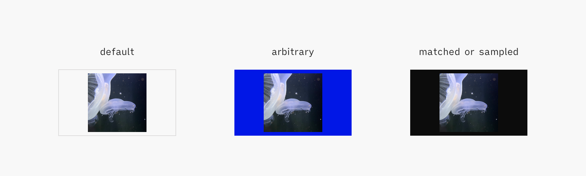

# Communication Guidelines

**(alpha release)**

<!-- pictooooo -->

 

>Writing gets real when it is read. Before that, it is a dream in letters. Writing to get read makes you careful, responsible, and considerate.

— [Oliver Reichenstein](https://ia.net/topics/take-the-power-back/)

 

>The way you communicate a thing creates the thing. The thing does not exist apart from its own communication.

— [Matt LeMay](https://twitter.com/mattlemay/status/1389961793175310344)

 

>Everything is vague to a degree you do not realize until you have tried to make it precise.

— Bertrand Russell

<!--BREAK-->

## Introduction

Communication is integral, not additive, to architecture — because it clarifies thinking, enables collaboration and supports scale.

This document encourages UXA practitioners to communicate by providing guidelines for efficient, consistent and memorable material. It's relevant for reference material, like best practices, and pedagogical material, like trainings. It’s not relevant for pitching, marketing nor UI copywriting.

Practitioners are expected to be familiar with UX concepts, that are only explained here when then have a specialized meaning in architecture. This document is thus a reference handbook: it inventories UXA conventions, but doesn’t explain nor justify them.

<!-- quick and easy for the author, consistent and memorable for the reader -->

<!-- in presentation decks, folioed documents, wiki pages, or printed posters -->

<!--BREAK-->

## Conventions

<!-- The principles exposed in this document aren’t tied to a particular deliverable nor scale. Rather, they should be considered recursively in each document, section within documents, blocks within sections etc and applied as fit. -->
<!-- Maladroit -->

Henceforth, every statement that’s not an explicit **must**, **must not** or **could** is assumed to be a **should**.

Some terms used throughout this document have a particular meaning in the UXA context:

Documents vs Presentations
: Documents are text-heavy, usually long-form material for individual reading or reference. They are exported from [Marked](https://marked2app.com/).  
Presentations are figure-heavy, usually short-form material for group training or evangelization. They are presented from  [Deckset](https://www.deckset.com/).

Figure
: Any diagram, chart, gif, illustration, photograph or screenshot.

Inline figures vs Full-screen figures
: Inline figures are presented alongside text, and are usually laid-out complementary to it.  
Full-screen figures take up the entirety of the page or slide.

Keyword
: Reference to a formally defined entity, rather than a generic notion.

Practitioner
: The UXA agent this guide is addressed to.

Section
: A distinct part of a document. Its length and presentation differs depending on the complexity and format of the document. It’s usually defined by headings or pages or slides break.

<!--BREAK-->

## 1. Content

What to communicate, in what order, to what level of detail.
<!-- what to write OR illustrate. notions apply to both; the point is to communicate clearly, not have detailed paperwork -->
<!-- outline -->

### 1.1. Providing an Overview

Expose an overview before the details.

An overview is easy to internalize for the audience and provides a mental scaffold upon which further details can be gradually added. It’s difficult to learn without this initial understanding.

Moreover, an overview may be the only way to get acquainted with the material, as some audiences may not have the time, interest or prerequisites to go through more elaborate content.

[Properties of good overviews]
| Property              | Description                                                                                     |
| --------------------- | ----------------------------------------------------------------------------------------------- |
| Short                 | Better be 80% right in a few words, than 99% right in a few pages                               |
| Broad                 | Describing all of the subsequent document, without being so generic as to be irrelevant         |
| Plain                 | Using everyday language                                                                         |
| Focused on intentions | Exposing the intention or purpose is shorter than explaining behaviour or describing properties |

It’s likewise recommended to expose guidelines, results, tips etc. upfront, for immediate actionability.
Supporting data, rationale, technical details etc. can be printed afterwards or progressively disclosed.

<!-- beware of tautologies -->

### 1.2. Capturing Context

Capture context about the work, within the work.

Context-setting is critical to the audience, as it’s likely coming from a different background, level of expertise, organization or task than the practitioner. Such context has to be presented outwards, e.g. in an introduction section or slide.

Context-setting is valuable to the practitioner too. Outward context intended for the audience will eventually be useful when coming back to an old project.
Some further context, exclusive to the practitioner, should also be captured: that of conventions and intentions local to the work. Such context has to be presented inwards, e.g. in presenter’s notes or edit-mode only comments at the beginning of a file.

The last benefit of capturing context is that trying to characterize the work often ends up focusing/curating it.
<!-- By exposing assumptions or gaps / forcing to clarify -->

Frequently captured context elements:

- Goals, scope, timeframe
- Target audience, prerequisites
- Assumptions, hypothesis
- Environment, setup, access rights, tech specs
- Terms of art
- Degree of maturity or stability, is the content a recommendation or an obligation

Note that the negatives are as important as the positives, and should be captured too.
E.g: “x is in scope but y is not” or “we’re assuming that x is desired but y is not”.
<!-- Extend to: capture all “realization” that seem obvious in retrospect, but actually came out after some thinking/conversation-->
<!-- aka non-goals -->

<!-- [Assumed Audiences](https://maggieappleton.com/assumed-audience) -->

### 1.3. Shaping Content

Strive to communicate through media other than text.

While text is often the default choice, it isn’t necessarily the best. Depending on the situation, comparison tables, data tables, decision trees, flowcharts, diagrams, illustrations, etc. can be more efficient to output and learn.

When text is unavoidable, it can often be reworked into more efficient shapes such as lists, key-value pairs, FAQs, presentations, etc.

### 1.4. Delineating Ideas

<!-- if plain text, then… -->

Each idea should be one section and one only.

First, express the idea in a few words.  
In most cases, the direct expression of the idea is self-sufficient: it’s easier to write than a full-blown rationale, and can be acted upon immediately.
<!-- Moreover, trading depth for breadth allows for a quick “initial overview”. -->
<!-- whats "the direct expression" though? -->

Afterwards, consider adding supporting information: rationale/justification, details, best practices, alternatives or further reading (e.g. relationship to other concepts, perspectives, controversies). All considerations are optional, but if present must remain in this order.

Don’t hesitate to emphasize the core idea from its supporting information through layout, type treatment, progressive disclosure etc.

<!-- WHAT ABOUT EXEMPLES/ILLUSTRATIONS? if only one: right after the idea. If several: colocated. -->

Alineas (line breaks) can be used within a paragraph to add structure.  
The preferred length of paragraphs is three or four sentences, but five or six are acceptable. The preferred average sentence is 17 words or less, but up to 20 is acceptable.

<!-- Keep annotations terse. Economy of concepts and terms is a primary goal. -->

<!-- beware of "améliorer la productivité / la qualité / l'innovation", always useless -->

### 1.5. Sourcing & Attribution

<!-- diff between sourcing and attribution? -->

#### 1.5.1. Sourcing

Make sure content, in particular fonts or images from Internet, are explicitly allowed to be used.

This can be achieved through various means, like an open-source license or the purchase of a commercial license.

<!-- authoritative / verified / quality (in data, in presentation) sourcing -->
<!-- Heh == prefer authoritative data -->
<!-- authoritative sourcing != legal sourcing -->

#### 1.5.2. Attribution

Most documents or presentations are built upon on other people’s ideas, data or work. It’s important to only ever use authorized material, and credit it properly.

Provide attribution for other people’s material.  
Inline attribution, located directly where the material is, is preferred. It works well for most quotes, tables or figures.
Reference attribution, separate from the material and gathered at the end of the document, is possible when inline attribution isn’t appropriate for aesthetic or technical reasons. It’s mostly for full-slide images.

If the author asks for a specific an attribution format, use it. If not, use the following:

- Inline: `<work title>, <author name>, <year of publication>`
- Reference: `<page/slide number>: <work title>, <author name>, <year of publication>`

Do not use footnotes for attribution.

<!-- provide examples: default, talk within a conference, figure within a document, etc. -->
<!-- the point is to be fair and useful (provide context), not be dogmatic nor academic -->

<!-- citation, attribution, sources, references, credits, further resources -->
<!-- [How to Cite Your Sources](https://gouldguides.carleton.edu/citation/attribution) -->
<!-- APA -->
<!-- titre *exact* de la section d’attribution? credits, bibliographie, sources, etc. -->

<!-- ### 1.6 Curating Examples

fo Pedagogical Quality

notion of it has to be simplified, caricatural, true enough to not suspend disbelief etc; in writing or illustrating -->

<!--BREAK-->

## 2. Writing Style

### 2.1. Actionability

<!-- Syntax -->

Apply a [parallel structure](https://owl.purdue.edu/owl/general_writing/mechanics/parallel_structure.html) whenever possible.
<!-- Omit the do etc. -->

Apply a [must/could/should](https://www.rfc-editor.org/rfc/rfc2119) or a do/don’t structure whenever possible.

<!-- Start with good practices
Don’t cover bad practices, unless some recurring misconception needs active correction. -->

### 2.2. Terminology

Be very mindful of wording.

Prefer generic terms over terms of art. Terms of art (words or phrases that have a precise, specialized meaning within a particular field or profession) are an essential communication tool, but should only be used to capture crucial meaning that would otherwise be lost. The only reason to use a technical term rather than a more common word is that it precisely expresses something that would otherwise be ambiguous or unclear.

Define acronyms, technical terms, uncommon words and common words that are used in an unusual or special way. Define them immediately following their first occurrence in the text.

Avoid abbreviations.

When several (about 10) new terms or abbreviations are used, provide a glossary or list of acronyms.
Include it in the document, or contribute and link to the **Terminology** (TBD).

Avoid synonyms, especially in domain-specific matters, as well as fuzzy terms and everything-buckets. Aim to reuse the same, simple words as much as possible.

Replace or clarify terms that could be interpreted in different ways. E.g. it is not clear if an “alert” is about an error message, a business rule, a push notification or an exception indicator.

Reconcile fuzzy spelling, e.g. “dropdown” vs “drop-down” vs “drop down”.

When referring to existing content, such as a UI or a diagram, spell commands, labels or messaging exactly as they appear in situ.

Everything-buckets are ill-defined terms that don’t really describe anything, such as “framework”. Their looseness often provide the appearance of consensus, to the detriment of actionability. Spot them and replace them with clearer explanations.

<!-- Règle de pouce finale : que la définition ne corresponde, exclusivement, qu’à un terme (bijectif). Example: la définition initiale de value stream peut aussi marcher pour process, framework, production pipeline etc = n’a aucune valeur. <proposer une meilleure definition> -->

<!-- ne pas expliquer le mot à l'aide du mot (tautologie) eg "preferences is where the ee sets their preferences" -->

<!-- Naming: [Naming things needn’t be hard](https://classnames.paulrobertlloyd.com/) -->

### 2.3. Spelling

Use American spelling. When in doubt, check the [Merriam-Webster dictionary](https://www.merriam-webster.com/).

### 2.4. Tone & Voice

For descriptions, use the present tense and the active form (e.g. “Selecting a value triggers validation”).
For instructions, use the second person imperative (e.g. “Remove test set”).

Prefer positive wording, and statements directed to what’s true rather than what’s false; it’s quicker to check.  
Use negative wording for prohibition or to correct misconceptions.

In any case be assertive, impersonal and use the [singular *they*](https://en.wikipedia.org/wiki/Singular_they) form.

<!-- Faire porter les énoncés sur ce qui est vrai plutôt que sur ce qui est faux (dans les tâches de vérification). Raison: on est plus rapide à vérifier ce qui est vrai que ce qui est faux. -->

<!-- use the passive voice if the object (thing being done) is more important than the subject (person doing the thing) -->

### 2.5. Formatting

<!-- Heh pas terrible, c’est plutôt “conventions et finitions” -->

<!-- A lot to cover. We’re only highlighting the most important points/recurring errors. Overall rule of thumb: be consistent with previous work and with the rest of the deliverable, mindful of typesetting. -->

#### 2.5.1. Capitalization, Style & Weight

- Headings must be title case,
- Everything else, including figure captions, must be sentence case,
- Keywords must be bolded. Boldface could also be used for emphasis.
- Foreign words must be italicized, and immediately followed by their translation in parentheses.

#### 2.5.2. Punctuation

- Avoid parentheses. Use commas or rephrase.
- Print periods in abbreviations (e.g., etc., i.e.)
- Punctuate list items with a period if it’s a complete sentence, or sentences, otherwise with commas. The last item is punctuated with a period.
- Use apostrophes to form possessives:
	- Singular nouns: add ‘s, even if they end in s (merchant’s, bus’s)
	- Plural nouns that don’t end in s: add ‘s (women’s, men’s)
	- Plural nouns that end in s: add an apostrophe (boxes’, customers’)

#### 2.5.3. Typographic Signs

Be mindful about typographic signs. In particular:

- Apostrophes and quote marks: curly instead of straight. Run the [smart-quotes-plus](https://atom.io/packages/smart-quotes-plus) package to sanitize deliverables.
- Fractions: real fractions like ¼ instead of fake ones like 1/4. Real fractions are supported by Inter and iA Writer Quattro.
- Multiplication signs: × instead of the letter x.
- Interpuncts: · instead of bullet points •.

Refer to [Glyphy](https://www.glyphy.io/) to grab rarer signs like ⅓, ↪ or ⚠.

<!-- Don’t use ampersands (&). They attract attention to the least important part of the sentence. Spell out the word “and.” -->

#### 2.5.4. Number and Dates

<!-- These guidelines are for American English, which is the language we use as a base before translating to other languages. However, dates, numbers, and measurements may be formatted differently in other languages. -->

Numbers representing quantities of 10 or more must be expressed in numerals ; those representing quantities less than 10 must be expressed in words. If a number is the first word in a sentence, it must be expressed in words.

Use commas for numbers with four or more digits. Whenever possible, don’t truncate numbers.

Use an en dash without a space on either side for number ranges (e.g. "88–110").

<!-- Preferred date/time format, units formats and spaces etc -->

<!-- Don’t use ordinal indicators, which are words representing position or rank in a sequential order (1st, 2nd, 3rd, and so on). -->

In all cases, include a non-breaking space (`option + space`) between the number and the unit.

When listing out multiple measurements in a row, put the unit of measurement at the end instead of after each number and include a space.

When possible, use the month’s full name, for example, October. If there are space constraints, use 3-letter abbreviations, for example, Oct.
<!-- Don’t write dates numerically, for example, 07-02-14. -->

#### 2.5.5. Misc

Use [semantic line breaks](https://www.gwern.net/docs/www/sembr.org/ac853de1a0d7c7da21880a7b54fad27f27da70f1.html), a.k.a. [ventilated prose](https://www.gwern.net/docs/www/vanemden.wordpress.com/e7f5b9a1d5d4332192fe6174976d02d863c255cc.html), whenever possible.

Semantic line breaks are  supported in Marked but not in Deckset. Deckset parses them like alineas, altering the rendering of the presentation.

<!--BREAK-->

## 3. Illustrating Style

>The greatest value of a picture is when it forces us to notice what we never expected to see.

— John Tukey, Exploratory Data Analysis, 1977

<!-- ### 3.1 Usage

When/what to illustrate: covers/back covers for style, caricatured examples for trainings, charts-instead-of-text, etc.

Illustrate profusely. At least an illustration every 2-3 slides. They help keep reader interest.

Always associate illustrations directly to the content they support, e.g. floated right.

Make sure full-page illustrations are commented in *presenter’s notes* (see xxx) as otherwise they lack the context required to be useful.

Don’t illustrate bad practices. In the rare case a bad practice has to be depicted, always depict the corresponding good practice immediately next to it. -->

### 3.1. Style

Use a consistent pictorial style for all comparable figures in a document, for example, all line drawings, or all photographs. Follow the style of the [moodboard](https://www.pinterest.ca/nwodtcobalt/uxa/).

Photographs or screenshots can be used as examples or explanations, but should not be used for editorial purposes. Prefer illustrations.

### 3.2. Grid

This guidance is most relevant for heavily templated tools like Deckset or Marked, that offer little control over the size, position or treatment of images. Manually laid out documents may go past the conventions covered here.

Units can be expressed as pixels (px), points (pt) or dips (dp) depending on the OS. They are hereafter noted as pixels for clarity.

<!-- A **unit** is the smallest measure a vertex can be positioned at in entire values. It depends on the physical and logical resolution of the device. -->

#### 3.2.1. Parameters

The UXA grid is set to an 8 px module.

<!-- module: The recurring measure/multiplier vertices are anchored at -->

#### 3.2.2. Form Factors

While the canonical 1600 × 900 px artboard size is well-suited to full-screen rendering, it can be unwieldy to use alongside text. Derived artboard sizes are available:

| Type         |  Size (px) | Usage                                               |
| ------------ | ----------:| --------------------------------------------------- |
| 1 artboard   | 1600 × 900 | Full-screen in presentation (or stand-alone)        |
| 1/2 artboard |  800 × 900 | Inline in presentation (e.g. next to bullet points) |
| 1/4 artboard |  800 × 450 | Inline in document (e.g. between two paragraphs)    |

#### 3.2.3. Layout

Various guides help lay out content quickly and consistently:

1. Artboard: export frame of the figure,
2. Measurement origin: virtual border from which all content should be measured and aligned, set so that content can be laid out on a 8 px grid within the larger 1600 × 900 px artboard,
<!-- origin correction -->
3. Visual clearance: whitespace around the content; 40 px for documents, 40 or 80 px for presentations. When editorial impact is desired, the clearance can be as small as 8 px or ignored altogether.
4. Content keylines: preferred alignment guides for content.

<!-- Inline doc: shave vertically as much as possible (to not disrupt reading flow).
Can be vertically shortened (only at export time, so that it’s easy to get back to nominal).
try and catch a preferred size.

 -->

#### 3.2.3. Preferred Sizes

Specific values along the 8 px grid are preferred when working on editorial layouts.

While an 8 px module is appropriate for fine work like UI design, it’s too granular for illustrations or pages layout, where elements are sized and positioned at a much bigger scale. Thus specific, bigger values are picked out of all the possible multiples of 8.

The preferred values are multiples of 8 (the UXA grid module) and 10 (another frequent grid module), ensuring scale and compatibility. Multiples of 4 (half UXA grid module) and 10 are also possible, as a second choice. Straight multiples of 8 are the last resort.

[Preferred Sizes]
| Priority | Rythm (px)      | Sample values (px)                                    |
| -------- | --------------- | ----------------------------------------------------- |
| 1        | 8 × 10          | 80, 160, 240, 320, 400, 480, 560, 640, 720, 800, etc. |
| 2        | 8 × 5 or 4 × 10 | 40, 80, 120, 160, 200, 240, 280, 320, 360, 400, etc.  |
| 3        | 8 × 1           | 8, 16, 24, 32, 40, 48, 56, 64, 72, 80, etc.           |

Note that these preferred values are just a starting point, merely minimizing accidental divergences. Better layouts require further refinement, like [harmonic scales](https://type-scale.com/) or [Renard series](https://en.wikipedia.org/wiki/Renard_series).

<!-- ### 3.4 Composition

Print several wires on the same artboard when documenting multi-parts components, content variations, states, etc.

Lay out steps or states horizontally, options vertically.

Arrange wires after a vertical axial symmetry.

If the wires do not fit in the artboard, consider cropping them, scaling them, or splitting up them up.

Selectively blur wires with the Supporting Content symbol to put the focus on the part that’s being documented.

Import the Shore Leave symbol and stretch it to match the artboard size.

Position callouts to the right of the wires as much as possible, so that the reader can have an unencumbered look at the UI before delving into the documentation.

Align callouts horizontally.

Leave a 5 px margin between the callout tip and the element it’s pointing at.

Avoid vertical callouts. Mixing horizontal and vertical annotation lines hinders reading and looks cluttered.

Avoid Descriptors or Area symbols. Only use them when they are absolutely needed to clarify what the callout is pointing at.

Arrange callouts by descending order of importance.

Don’t burn explanation text in illustrations, as it incurs extra maintenance. Short floating labels are acceptable when describing multi-parts illustrations.

Don’t call out every part of the wireframe. Instead, focus on the key parts that you intend to explain in the annotations. -->

### 3.4. Export

Export to SVG by default.  
SVG files are scalable, interoperable, programmatically manipulable and lightweight.
Some specific use cases may require other formats:

| Priority | Format | Scaling | Usage                                                            |
| -------- | ------ | ------- | ---------------------------------------------------------------- |
| 1        | SVG    | 1x      | Vector figures without text nor blend modes (e.g. illustrations) |
| 2        | PDF    | 1x      | Vector figures with text or blend modes (e.g. diagrams)          |
| 3        | PNG    | 2x      | Screenshots, UI mockups                                          |
| 4        | JPG    | 2x      | Photos, scanned documents                                        |

Set an illustration background color, `Gris 0106 Béton Clair` by default.
<!-- Marked-only? -->

Illustration assets can be rendered in a variety of contexts such as a high-contrast Markdown client, a dark-mode browser or a hand-off, inspection or version control tool. Their background color is unknown, and could make the illustration foreground illegible.

Moreover, some photos may not have a 16:9 aspect ratio meaning the document background will show through. Depending on the photo, the `Gris 0106 Béton Clair` background may not work well. In this case, it’s possible to select the closest-matching UXA color (e.g. `Noir 1571 Jais`), or to sample an appropriate color from the photo.
<!-- Heh that’s actually slide bg , not illo bg + 90% scaling-->

Do not pick an arbitrary background color for editorial purposes, like calling for attention or impact.
<!-- divider entre recommendations marked et recommendations deckset ? peu d’overlap au final -->

<!--BREAK-->

## 4. Tools

Setting up [Deckset](https://www.deckset.com/) and [Marked](https://marked2app.com/), the preferred tools for publishing UXA material.
<!-- thats a description when everything else is an instruction -->

### 4.1. Marked

One-time Marked configuration:

- Enable `Export`/`Prevent orphaned headlines`
- Enable `Export`/`Add page breaks before: Footnotes`

Recurring document preparation:

- Ensure there’s a `<!--BREAK-->` tag immediately after the first H1, to yield a clean cover page
- Set the theme to [UXASF1](https://github.com/nWODT-Cobalt/markown-utilities)
- Select `Export As`/`Save PDF (Paginated)`

<!-- Major divisions of the document should begin on right hand-pages. Right-hand pages shall be odd-numbered pages, and left hand pages shall be even-numbered pages. -->

<!-- A user document shall have a table of contents unless it has fewer than three divisions or fewer than six pages. A table of contents shall include: (a) at least two levels of the headings and subheadings of the document, (b) appendixes if they exist, (d) list of exhibits, illustrations, figures and tables if they exist, and (e) the original page number of each item listed. The table of contents shall begin on a right-hand page. -->

### 4.2. Deckset

Present or export Deckset files with the [UXASF1](https://github.com/nWODT-Cobalt/uxa/tree/main/Resources/Deckset) theme.

A content boilerplate file [is available](https://github.com/nWODT-Cobalt/uxa/tree/main/Resources/Deckset).

<!-- Keep it focused, keep it small. 5 slides or less is perfectly fine. People can’t remember more than 3 points from a speech. (KK) -->
<!-- Actually: make small, focused documents all the time -->

Do not hesitate to format Deckset presenter’s notes; they will render so in Deckset and on Github.

<!--BREAK-->

<!--
## 5 Naming Convention & File Organization

Naming schemes ? esp for artboards

Names: case sensitive, no spaces (within a project, not between projects)
-->

<!--BREAK-->

## 5. Sources

- Règles de rédaction et de présentation des ouvrages scientifiques et techniques, Michel Foulon, 2003
- Grammar and mechanics — Shopify Polaris, Shopify, 2022 ([link](https://polaris.shopify.com/foundations/content/grammar-and-mechanics))
- Human Factors Design Standard (HFDS), FAA, 2003 ([link](https://hf.tc.faa.gov/hfds/))
- IND6406 Ergonomie Cognitive — Les procédures de travail, Jean-Marc Robert, 2009
- Swift API Design Guidelines, Apple, 2020 ([link](https://swift.org/documentation/api-design-guidelines/))

<!--BREAK-->

<!--

- desc for all img and tables
- overall reorganize as “high-level considerations” that require thinking (eg overview before details) vs “settings to just know”, eventually lintable (eg punctuation) / boilerplate f(type of document)
- mettre juste après l’intro un recap ~normatif en 5-10 pts pour lancer le monde (pas juste les praticiens UXA) (et linker chaque point vers sa section etc). Genre le premier truc à donner à qqun qui commencerait. noter que tjrs applicable, à différents niveaux, et pas juste pour marked/deckset. sous forme de slides plutot, et juste mentionné ici ?
- Handbook / IND6408 / IND6402
- UXA·ID?
- Page numbers?
- Titles on individual slides?
- Highlight sparsely (e.g. command names, symbol names)?
- TOC, recap?
- Qualités: Validité, Clarté/Transparence, Granularité, Uniformité, Cohérence, Complétude, Disponibilité, Accessibilité, Utilisabilité
- Pour chaque action significative ou groupe d’actions significatives reliées, on inclut une ou des vérifications afin de s’assurer que leur exécution a apporté les résultats attendus.
- Un titre d’activité ne contient pas de verbe d’action afin de ne pas le confondre avec une étape
- Embrace precedent. Don’t optimize terms for the total beginner at the expense of conformance to existing culture.
- Keep annotations terse. Economy of concepts and terms is a primary goal.
- controlled list of values
- style guide TLDR: noir jais pour premier plan, gris béton clair pour arrière plan, bleu xxx pour emphase, gris xxx pour déemphase. color variation/blending is possible, except on the core black/grey/blue, that should always be most of the opaque pixels of the figure
- <https://plain-words.com/>
- Organize technical guidance after the process it’s a part of, eg icons or libs guidance
- Governance: who does what, who’s checking what, who says things are good to go etc. What’s the contribution model past the initial effort, etc.
- replace document, too generic, with ~report or so
- <https://classnames.paulrobertlloyd.com/>

---

How to write normative templates/definitions (eg for publishing to a platform)

- Be explicit and exclusive
- (local) unambiguous terminology/anatomy
- best practices/intention/expectations/examples
- responsabilities: product designer/stakeholders provide domain input, DLS/platform people provide templates/channels/actual publication/outputs

-->
