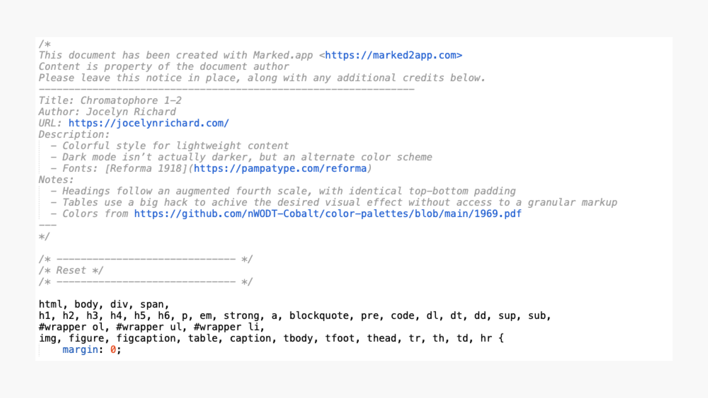
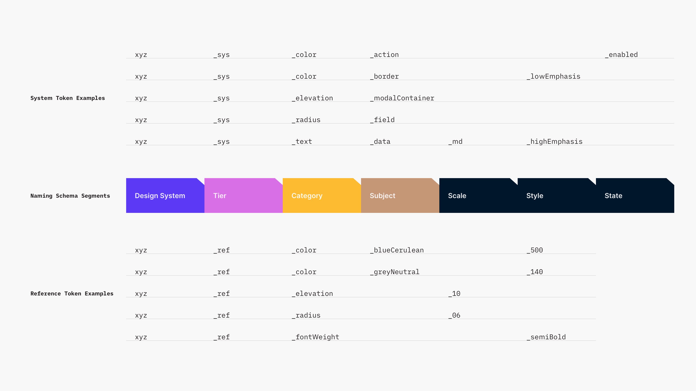
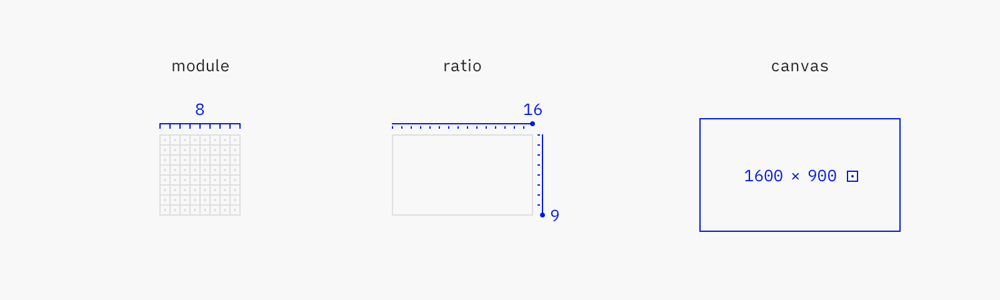
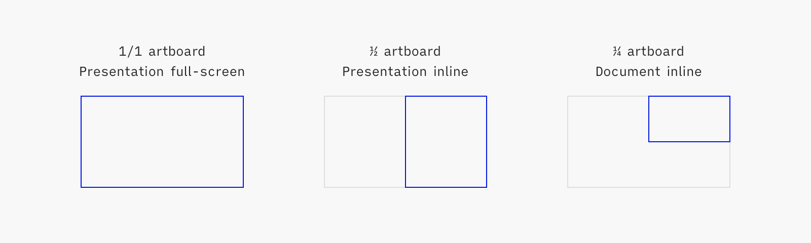
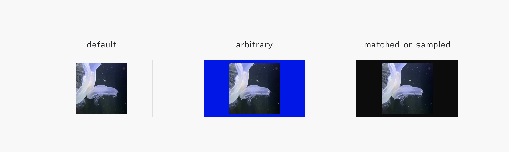

# Communication Guidelines

<!--BREAK-->

 

>Writing gets real when it is read. Before that, it is a dream in letters. Writing to get read makes you careful, responsible, and considerate.

— Oliver Reichenstein

 

>The way you communicate a thing creates the thing. The thing does not exist apart from its own communication.

— Matt LeMay

 

>Everything is vague to a degree you do not realize until you have tried to make it precise.

— Bertrand Russell

## Introduction

Communication is integral, not additive, to architecture — because it clarifies thinking, enables collaboration and supports scale.

This document provides guidelines for writing that’s quick and easy for the author, meaningful and memorable to the reader.

for efficient, consistent and memorable material.
It’s relevant for reference material like best practices, and pedagogical material like trainings.
It’s not relevant for pitching, marketing or UI copywriting.

Practitioners are expected to be familiar with UX concepts. This document is a reference handbook: it inventories UXA conventions, but doesn’t explain nor justify them.

<!-- Concepts are only explained here when then have a specialized meaning in architecture. -->

<!--BREAK-->

## Conventions

Henceforth, every statement that’s not an explicit **must**, **must not** or **could** is assumed to be a **should**.

These guidelines are for American English. Other languages have different rules and conventions.

<!-- for example for numbers, dates, capitalization. -->

Units of measurement could be  pixels (px), points (pt) or dips (dp) depending on the operating system or device in use.
For clarity, they are hereafter noted as pixels only.

<!-- A unit is the smallest measure a vertex can be positioned at in entire values. It depends on the physical and logical resolution of the device. -->

Some terms used throughout this document have a particular meaning in the UXA context:

Documents vs Presentations
: Documents are text-heavy, usually long-form material for individual reading or reference. They are exported from [Marked](https://marked2app.com/).  
Presentations are figure-heavy, usually short-form material for group training or advocacy. They are presented from  [Deckset](https://www.deckset.com/).

Figure
: Any diagram, chart, gif, illustration, photograph or screenshot.

Inline figures vs Full-screen figures
: Inline figures are presented alongside text, and are usually laid-out complementary to it.  
Full-screen figures take up the entirety of a page or slide.

Keyword
: Reference to a formally defined entity, rather than a generic notion.

<!-- search and replace throughout the whole doc -->

Practitioner
: The UXA agent this guide is addressed to.

Section
: A distinct part of a document. Its length and presentation differs depending on the complexity and format of the document. It’s usually defined by headings or pages or slides break.

<!--BREAK-->

## 1. Content

What to communicate, in what order, to what level of detail.

<!-- outline (???)-->

### 1.1. Providing an Overview

Expose an overview before the complete content.

An overview is easy to internalize for the audience and provides a mental scaffold upon which further details can be gradually added. It’s difficult to learn without this initial understanding.

Moreover, an overview may be the only way to get acquainted with the material, as some audiences may not have the time, interest or prerequisites to go through the complete content.

[Properties of good overviews]
| Property        | Description                                                                                     |
| --------------- | ----------------------------------------------------------------------------------------------- |
| Short           | Better be 80% right in a few words, than 99% right in a few pages                               |
| Broad           | Describing all of the subsequent document, without being so generic as to be irrelevant         |
| Plain           | Using everyday language                                                                         |
| Intention-based | Exposing the intention or purpose is clearer than explaining behaviour or describing properties |

It’s likewise recommended to expose guidelines, results, tips etc. upfront, for immediate actionability.
Whereas supporting data, rationale, technical details etc. can be printed afterwards, or progressively disclosed.

### 1.2. Capturing Context

Capture context about the work, within the work.

Context-setting is critical to the audience, as it’s likely coming from a different background, level of expertise, organization or task than the practitioner. Such context has to be presented outwards, e.g. in an introduction section or slide.

Context-setting is valuable to the practitioner too. Outward context intended for the audience will eventually be useful when coming back to an old project.
Some further context, exclusive to the practitioner, should also be captured: that of conventions and intentions local to the work. Such context has to be presented inwards, e.g. in presenter’s notes or edit-mode only comments at the beginning of a file.

The last benefit of capturing context is that trying to characterize the work often ends up focusing and curating it.

Frequently captured context elements include:

- Goals, scope, timeframe
- Target audience or [assumed audiences](https://maggieappleton.com/assumed-audience), prerequisites
- Assumptions, hypothesis
- Environment, setup, access rights, tech specs
- Terms of art
- Degree of maturity or stability, is the content a recommendation or an obligation

Note that the negatives are as important as the positives, and should be captured too.
E.g: “x is in scope but y is not” or “we’re assuming that x is desired but y is not”.

Likewise, any realization that was only formulated after some thinking, now matter how technically inferable it is, should be captured as well.
E.g: “a consequence of x and y is z”.

### 1.3. Shaping Content

Strive to communicate through media other than text.

While text is often the default choice, it isn’t necessarily the best. Depending on the situation, comparison tables, data tables, decision trees, flowcharts, diagrams, illustrations, etc. can be more efficient to output and learn.

When text is unavoidable, it can often be reworked into more efficient shapes such as lists, key-value pairs, FAQs, etc.

### 1.4. Delineating Ideas

Each idea should be one section and one only.

First, express the idea in a few words.  
In most cases, the direct expression of the idea is self-sufficient: it’s easier to write than a full-blown rationale, and can be acted upon immediately by the reader.
<!-- whats “the direct expression” though? -->

Consider adding supporting information afterwards, in this order:

- Examples
- Rationale
- Justification
- Details
- Best practices
- Alternatives
- Further reading (e.g. relationship to other concepts, perspectives, controversies)

Don’t hesitate to emphasize the core idea from its supporting information through layout, type treatment, progressive disclosure etc.

Alineas (line breaks) can be used within a paragraph to add structure.  
The preferred length of paragraphs is three or four sentences, but five or six are acceptable. The preferred average sentence is 17 words or less, but up to 20 is acceptable.

### 1.5. Sourcing & Attribution

Most documents or presentations are built upon on other people’s ideas, data or work.
It’s important to only ever use accurate and authorized material, and credit it properly.

#### 1.5.1. Sourcing Quality

Prefer material from authoritative sources.

Sources are authoritative when they are reputable, their information quantified, their methodologies and datasets publicly verifiable, etc.

#### 1.5.2. Sourcing Legal Compliance

Make sure content, in particular fonts or images from the Internet, are explicitly allowed to be used.

This can be achieved through various means, like the usage of an open-source license or the purchase of a commercial license.

#### 1.5.3. Attribution

Provide attribution for other people’s material.

Inline attribution, located directly where the material is, is preferred. It works well for most quotes, tables or figures.
Reference attribution, separate from the material and gathered at the end of the document in a “Sources & Credits” section, is possible when inline attribution isn’t appropriate for aesthetic or technical reasons. It’s mostly for full-slide images.

If the author asks for a specific an attribution format, use it. If not, use the following:

- Inline: `<work title>, <author name>, <year of publication>`
- Reference: `<page/slide number>: <work title>, <author name>, <year of publication>`

<!-- provide examples: default, talk within a conference, figure within a document, etc. -->
<!-- the point is to be fair and useful (provide context), not be dogmatic nor academic -->

Do not use footnotes for attribution.

<!-- Mention people in credits! -->
<!-- [How to Cite Your Sources](https://gouldguides.carleton.edu/citation/attribution) -->

<!--
### 1.6 Curating Examples for Pedagogical Quality

notion of: it has to be simplified, caricatural, true enough to not suspend disbelief etc; in writing or illustrating
-->

<!--BREAK-->

## 2. Writing Style

### 2.1. Syntax

<!-- fka Actionability -->

Apply a [parallel structure](https://owl.purdue.edu/owl/general_writing/mechanics/parallel_structure.html) whenever possible.

Apply a [must/could/should](https://www.rfc-editor.org/rfc/rfc2119) or a do/don’t structure whenever possible.

<!-- must not/don’t have to/should not -->
<!-- Omit the “do”? -->

### 2.2. Terminology

Be very mindful of wording.

Prefer generic terms over terms of art. Terms of art (words or phrases that have a precise, specialized meaning within a particular field or profession) are an essential communication tool, but should only be used to capture crucial meaning that would otherwise be lost. The only reason to use a technical term rather than a more common word is that it precisely expresses something that would otherwise be ambiguous or unclear.

Define acronyms, technical terms, uncommon words and common words that are used in an unusual or special way. Define them immediately following their first occurrence in the text.

Avoid abbreviations.

When several (about 10) new terms or abbreviations are used, provide a glossary or list of acronyms.
Include it in the document, or contribute and link to a greater terminology reference.

Avoid synonyms, especially in domain-specific matters, as well as fuzzy terms and everything-buckets. Aim to reuse the same, simple words as much as possible.

Replace or clarify terms that could be interpreted in different ways.
E.g. it is not clear if an “alert” is about an error message, a business rule, a push notification or an exception indicator.

Reconcile fuzzy spelling.
E.g. “dropdown” vs “drop-down” vs “drop down”.

Everything-buckets are ill-defined terms that don’t really describe anything, such as “framework”. Their looseness often provide the appearance of consensus, to the detriment of actionability. Spot them and replace them with clearer explanations.

<!-- Spot and dispel ambiguities -->

Avoid tautologies.
E.g. “Preferences is where the user can adjust the appearance and behaviour of the front-end on this device”, not “Preferences is for user preferences”.

When referring to existing content, such as a UI or a diagram, spell commands, labels or messaging exactly as they appear in situ.

Overall, keep terminology terse. Economy of concepts and terms is a primary goal.

### 2.3. Spelling

Use American spelling. When in doubt, check the [Merriam-Webster dictionary](https://www.merriam-webster.com/).

### 2.4. Tone & Voice

<!-- Hmmmmmmmmmmmmmmmmmmmmmmmmmmmmmmmmmmmmmmmmmmmmmmmmmmmmmmmmmmmm -->

For descriptions, use the present tense and the active form (e.g. “Selecting a value triggers validation”).
For instructions, use the second person imperative (e.g. “Remove test set”).

<!-- use the passive voice if the object (thing being done) is more important than the subject (person doing the thing) -->

Prefer positive wording, and statements directed to what’s true rather than what’s false; it’s quicker to check.  
Use negative wording for prohibition or to correct misconceptions.

In any case be assertive, impersonal and use the [singular *they*](https://en.wikipedia.org/wiki/Singular_they) form.

### 2.5. Formatting

<!-- “conventions et finitions” ?-->

<!--Overall rule of thumb: be consistent with previous work and with the rest of the deliverable, mindful of typesetting. -->

#### 2.5.1. Capitalization, Style & Weight

- Headings must be title case,
- Everything else, including figure captions, must be sentence case,
- Keywords must be bolded,
- Foreign words must be italicized, and immediately followed by their translation in parentheses,
- Boldface could also be used, sparsely, for emphasis.

#### 2.5.2. Punctuation

- Avoid parentheses; use commas or rephrase,
- Print periods in abbreviations: “e.g.”, “etc.”, “i.e.”,
- Punctuate list items with commas, or a period if it’s one or several complete sentences. The last item is punctuated with a period.
- Use apostrophes to form possessives:
	- Singular nouns: add ‘s, even if they end in s like “merchant’s” or “bus’s”,
	- Plural nouns that don’t end in s: add ‘s like “women’s” or “men’s”,
	- Plural nouns that end in s: add an apostrophe like “boxes’" or “customers’".

#### 2.5.3. Typographic Signs

Be mindful about typographic signs. In particular:

- Apostrophes and quote marks: curly instead of straight. Text or code editors offer preferences or packages to automatically sanitize documents accordingly.
- Fractions: real fractions like ¼ instead of fake ones like 1/4. Real fractions are supported by Inter and iA Writer Quattro.
- Multiplication signs: × instead of the letter x,
- Interpuncts: · instead of bullet points •,
- Ampersands (&): spell out the word “and” instead. In running copy, ampersands attract attention to the least important part of the sentence.

Refer to [Glyphy](https://www.glyphy.io/) to grab rarer signs like ⅓, ↪ or ⚠.

#### 2.5.4. Numbers

Numbers representing quantities of 10 or more must be expressed in numerals; those representing quantities less than 10 must be expressed in words.
If a number is the first word in a sentence, it must be expressed in words.

Use commas for numbers with four or more digits.

Whenever possible, don’t truncate numbers.

Use an en dash without a space on either side for number ranges.
E.g. “88–110”.

In all cases, include a non-breaking space (`option + space`) between the number and the unit.
E.g. “2,172 km/h”.

When listing out multiple measurements in a row, put the unit of measurement at the end instead of after each number.
E.g. “95, 119 and 500 L”.

#### 2.5.5. Date & Time

For copywriting, use the `MMMM d, yyyy` format.
E.g. “March 6, 2026”.

It’s readable, familiar, and works well in sentences.

Depending on context (for example, in short-lived deliverables), the year could be omitted.
If there are space constraints, the month could be abbreviated to three letters.
E.g. “Mar 6”.

<!-- no leading zeros for days, and a 4-digit year.
Do not use ordinal suffixes (“March 29”, not “March 29th”) -->

For technical material, datasets or computer processing, use the [ISO 8601](https://en.wikipedia.org/wiki/ISO_8601) `YYYY-MM-DD` format.
E.g. “2026-03-06”.

It's unambiguous worldwide, machine-friendly, and works well in tables.

<!-- Pas besoin de précision heure/seconde pour faire des ppts. En UI ce serait une autre histoire. -->

<!--BREAK-->

## 3. Illustration Style

>The greatest value of a picture is when it forces us to notice what we never expected to see.

— John Tukey, Exploratory Data Analysis, 1977

### 3.1. Grid & Sizing

#### 3.1.1. Parameters

The UXA grid is set to an 8 px module, arranged in a 16:9 ratio.

<!-- module: The recurring measure/multiplier vertices are anchored at -->

#### 3.1.2. Form Factors

While the canonical 1600 × 900 px frame size is well-suited to full-screen rendering, it can be unwieldy to use alongside text, especially in tools like [Marked](https://marked2app.com/) or [Deckset](https://www.deckset.com/) that offer little control over the size, position or treatment of images.
Derived artboard sizes are available:

| Type    |  Size (px) | Usage                                               |
| ------- | ----------:| --------------------------------------------------- |
| 1 frame | 1600 × 900 | Full-screen in presentation (or stand-alone)        |
| ½ frame |  800 × 900 | Inline in presentation (e.g. next to bullet points) |
| ¼ frame |  800 × 450 | Inline in document (e.g. between two paragraphs)    |

<!-- Manually laid out documents may go past the conventions covered here. -->

#### 3.1.3. Layout

Various guides help lay out content quickly and consistently:

1. Frame: export area of the figure
2. Measurement origin: virtual border from which all content should be measured and aligned, set so that content can be laid out on a 8 px grid within the larger 1600 × 900 px frame
<!-- origin correction -->
3. Visual clearance: whitespace around the content; 40 px for documents, 40 or 80 px for presentations. When editorial impact is desired, the clearance can be as small as 8 px or ignored altogether.
4. Content keylines: preferred alignment guides for content

In inline usages (½ or ¼ frames), consider trimming the eventual bottom whitespace, so that the illustration doesn't unnecessarily disrupt the reading flow.
Trim to a preferred size.

<!-- exampleeeee -->

#### 3.1.4. Preferred Sizes

While an 8 px module is appropriate for fine work like UI design, it’s too granular for illustration or page layouts, where elements are sized and positioned at a much bigger scale. Thus specific, bigger values are picked out of all the possible multiples of 8.

The preferred values are multiples of 8 (the UXA grid module) and 10 (another frequent grid module), ensuring scale and compatibility. Multiples of 4 (half UXA grid module) and 10 are also possible, as a second choice. Direct multiples of 8 are the last resort.

[Preferred Sizes]
| Priority | Rythm (px)      | Sample values (px)                                    |
| -------- | --------------- | ----------------------------------------------------- |
| 1        | 8 × 10          | 80, 160, 240, 320, 400, 480, 560, 640, 720, 800, etc. |
| 2        | 8 × 5 or 4 × 10 | 40, 80, 120, 160, 200, 240, 280, 320, 360, 400, etc.  |
| 3        | 8 × 1           | 8, 16, 24, 32, 40, 48, 56, 64, 72, 80, etc.           |

Note that these preferred values are just a starting point, merely minimizing accidental divergences. Better layouts require further refinement, like [harmonic scales](https://type-scale.com/) or [Renard series](https://en.wikipedia.org/wiki/Renard_series).

### 3.2. Art Direction

Use a consistent pictorial style for all comparable figures in a document.
For example, all line drawings, or all photographs.

Follow the style of the [moodboard](https://www.pinterest.ca/nwodtcobalt/uxa/).

<!-- Also Midjourney’s `--sref` and `--p` (code?) -->

Photographs or screenshots can be used as examples or explanations, but should not be used for editorial purposes. Prefer illustrations.

### 3.3. Export

#### 3.3.1. File Format

Export to SVG by default.  
SVG files are scalable, interoperable, programmatically manipulable and lightweight.

Some specific use cases may require other formats:

| Priority | Format | Scaling | Usage                                                            |
| -------- | ------ | ------- | ---------------------------------------------------------------- |
| 1        | SVG    | 1x      | Vector figures without text nor blend modes (e.g. illustrations) |
| 2        | PDF    | 1x      | Vector figures with text or blend modes (e.g. diagrams)          |
| 3        | PNG    | 3x      | Screenshots, UI mockups                                          |
| 4        | JPG    | 3x      | Photos, scanned documents                                        |

If an illustration was exported as a SVG or PDF, export it as a PNG or JPG as well.
While not the preferred formats, bitmaps are sometimes required for compatibility.

<!-- On pourrait officiellement dispenser du suffixe @3x -->

#### 3.3.2. Background Color

Set an illustration background color, `Gris 0106 Béton Clair` by default.

Illustration assets can be rendered in a variety of contexts such as a high-contrast Markdown client, a dark-mode browser or a hand-off, inspection or version control tool. Their background color is unknown, and could make the illustration foreground illegible.

Moreover, some photos may not have a 16:9 aspect ratio meaning the document background will show through. Depending on the photo, the `Gris 0106 Béton Clair` background may not work well. In this case, it’s possible to select the closest-matching UXA color (e.g. `Noir 1571 Graphite`), or to sample an appropriate color from the photo.

Do not pick an arbitrary background color for editorial purposes, like calling for attention or impact.

<!--BREAK-->

## 4. Tools

Setting up [Marked](https://marked2app.com/) and [Deckset](https://www.deckset.com/), the preferred tools for publishing UXA material.

### 4.1. Marked

One-time Marked configuration:

- Enable `Export`/`Prevent orphaned headlines`
- Enable `Export`/`Add page breaks before: Footnotes`

Recurring document preparation:

- Ensure there’s a `<!--BREAK-->` tag immediately after the first H1, to yield a clean cover page
- Set the theme to [UXA](https://github.com/nWODT-Cobalt/markown-utilities)
- Select `Export As`/`Save PDF (Paginated)`

<!-- Major divisions of the document should begin on right hand-pages. Right-hand pages shall be odd-numbered pages, and left hand pages shall be even-numbered pages. -->

<!-- A user document shall have a table of contents unless it has fewer than three divisions or fewer than six pages. A table of contents shall include: (a) at least two levels of the headings and subheadings of the document, (b) appendixes if they exist, (d) list of exhibits, illustrations, figures and tables if they exist, and (e) the original page number of each item listed. The table of contents shall begin on a right-hand page. -->

### 4.2. Deckset

Present or export Deckset files with the [UXA](https://github.com/nWODT-Cobalt/uxa/tree/main/Resources/Deckset) theme.

A content boilerplate file [is available](https://github.com/nWODT-Cobalt/uxa/tree/main/Resources/Deckset).

<!-- Keep it focused, keep it small. 5 slides or less is perfectly fine. People can’t remember more than 3 points from a speech. (KK) -->
<!-- Actually: make small, focused documents all the time -->

Consider formatting Deckset presenter’s notes; they will render so in Deckset and on Github.

<!-- Make sure figures are exported in SVG or PDF when possible, or as @3x PNG otherwise. No need for dupe export. -->

<!-- Vector figures (SVG or PDF) often render with slight visual artefacts during playback or export. Pair them with bitmap exports (PNG or JPG), and use those assets instead.
Keep the vector figures. The file duplication is not significant, while the potential for reuse is. -->

<!-- in deckset all header /text items need to have the same font-size/line-height -->

<!--BREAK-->

<!--
## 5 Naming Convention & File Organization

Naming schemes ? esp for artboards

Names: case sensitive, no spaces (within a project, not between projects)

naming convention: lib artboards, exported assets, styles, frames (add to starterkit)
-->

<!--BREAK-->

## 5. Sources & Credits

- Règles de rédaction et de présentation des ouvrages scientifiques et techniques, Michel Foulon, 2003
- Grammar and mechanics — Shopify Polaris, Shopify, 2022 ([link](https://polaris.shopify.com/foundations/content/grammar-and-mechanics))
- Human Factors Design Standard (HFDS), FAA, 2003 ([link](https://hf.tc.faa.gov/hfds/))
- IND6406 Ergonomie Cognitive — Les procédures de travail, Jean-Marc Robert, 2009
- Swift API Design Guidelines, Apple, 2020 ([link](https://swift.org/documentation/api-design-guidelines/))
