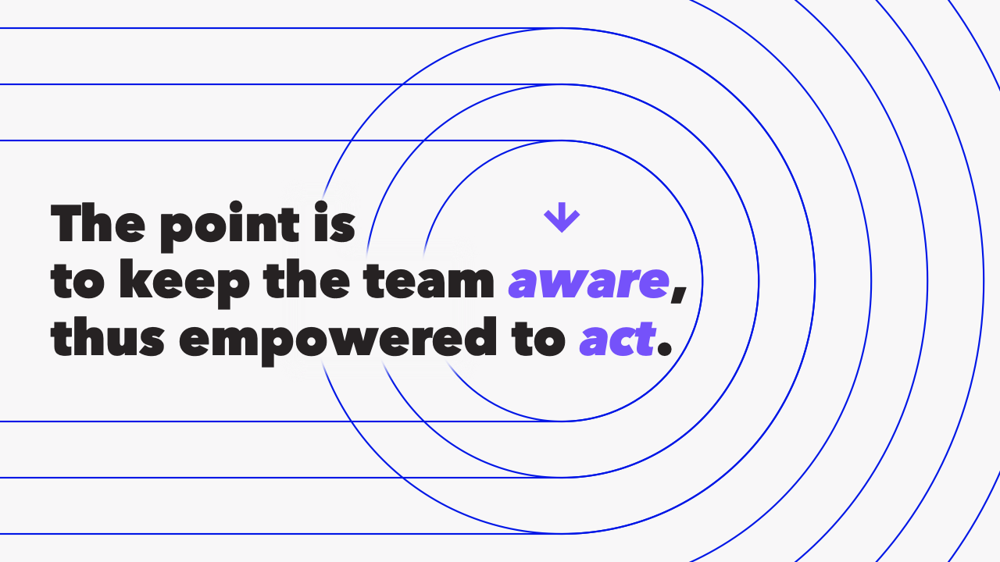
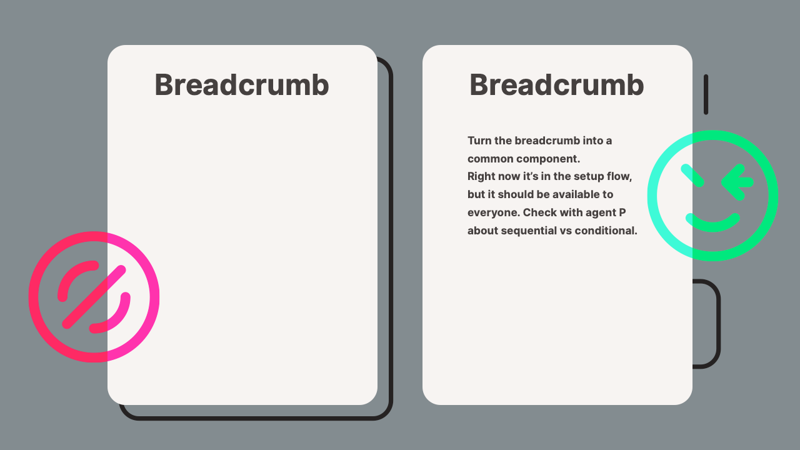
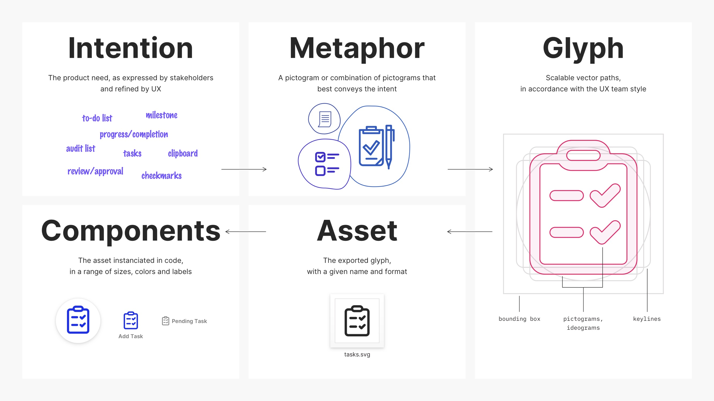
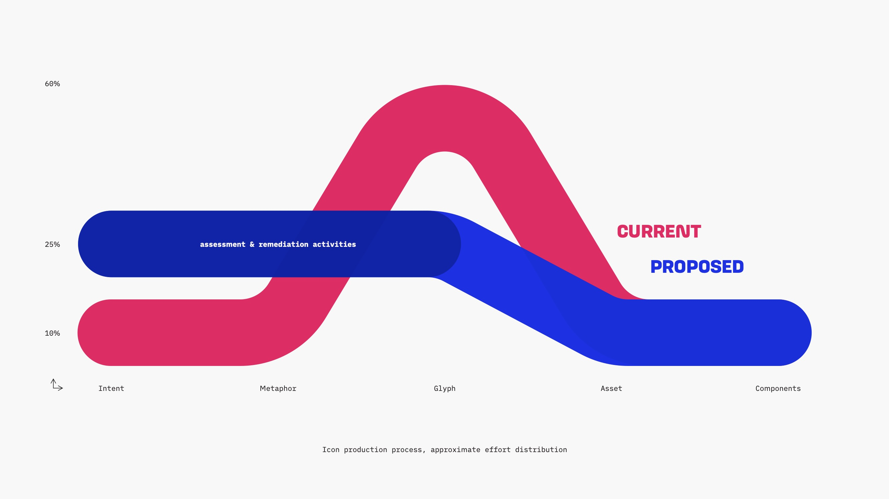

theme: UXASF1
autoscale: true

# Examples of Good Communication Material
#### (alpha release)

<!--  -->

<!-- ---

Copywriting, figures or compositions from existing UXA material that illustrate `Communication Guidelines` well. -->

---

only one statement on the slide, with attention-calling treatment

[.text: #F8F8F8, alignment(center)]
[.background-color: #232323]

---

simplified figure instead of screenshot

[.text: #F8F8F8, alignment(center)]
[.background-color: #232323]

---

visual examples and relationships + write-ups building on each other

[.text: #F8F8F8, alignment(center)]
[.background-color: #232323]

---

striking visual, emphasizing the difference between proposals

[.text: #F8F8F8, alignment(center)]
[.background-color: #232323]

<!-- ---

<background cover image> -->
