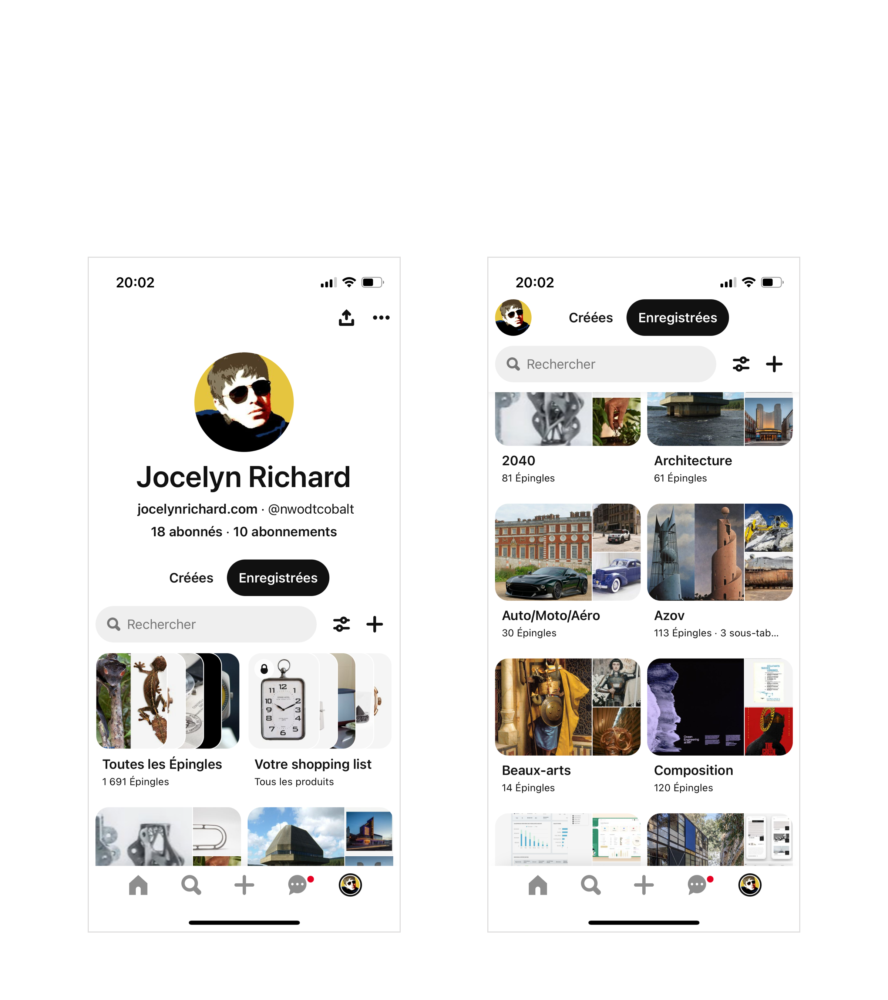
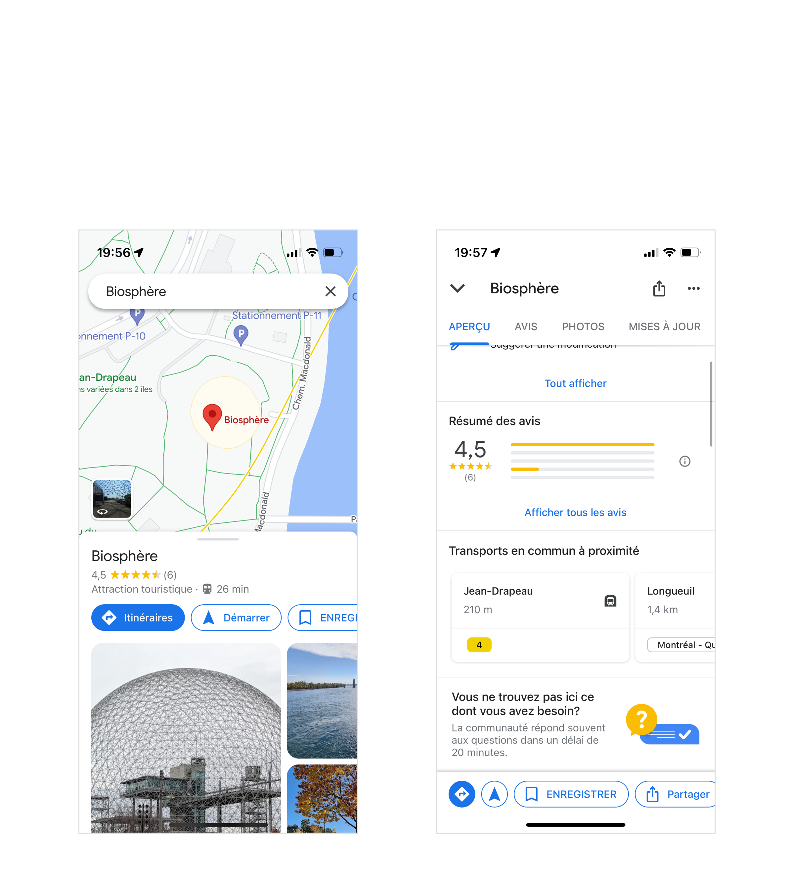
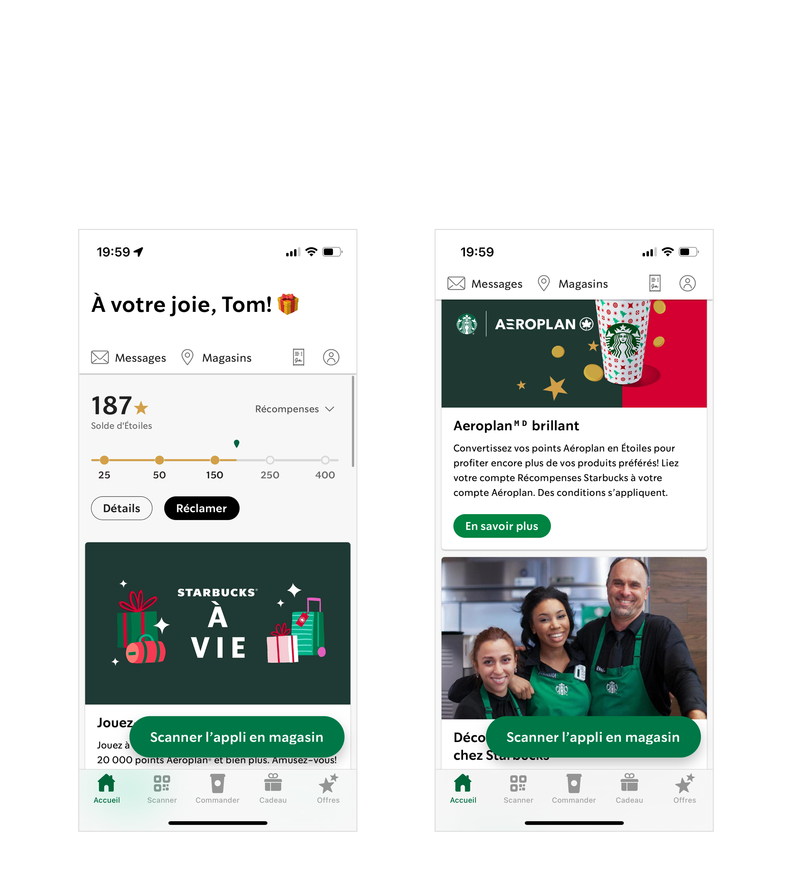

theme: UXASF1
autoscale: true

# Mutable Inline Navigation

<!-- Malleable header-->

---

## Definition

**Mutable inline navigation:
a secondary navigation utility,
slightly changing in appearance and functionality upon content scroll.**

<!-- **A secondary navigation device,
swapping one preset version for another upon content scroll.** -->

In complex apps, the primary navigation may only address a handful of key views.
Secondary views, or point locations within content-heavy primary views, can be supported with a dedicated secondary navigation.

---

## Example 1: Pinterest

In the initial state the user avatar is a share button; in the scrolled state, it’s a “back to top” button.

Selecting `Created` (“Créées”), `Saved` (“Enregistrées”) or `Search` (“Rechercher”) automatically puts the view into scrolled state.

In both states, the `Preferences` and `Create` buttons trigger modal overlays.

---

## Example 2: Google Maps

Several successive levels of **Mutable Inline Navigation** as content is being scrolled.

In the final state, the layout and features have entirely changed: buttons are replaced with tabs, the title gets a different treatment and content controls are added.

The caret next to the name of the venue (“Biosphère”) resets the view to the initial state.

---

## Example 3: Starbucks

`Messages`, `History` and `Account` drill down to new views, still within the `Home` tab.

`Shops` (“Magasins”) triggers a modal overlay.

<!-- thats just a sticky scroll -->

---

## Best Practices

Intrinsic:

- Printed inline in a content view
- Leads to another position the current view, an overlay to the current view, or to a child view

Upon scroll:

- Sticky at top
- Changes in appeareance and functionality, whilst preserving visual continuity
- Possible “back to top” control
