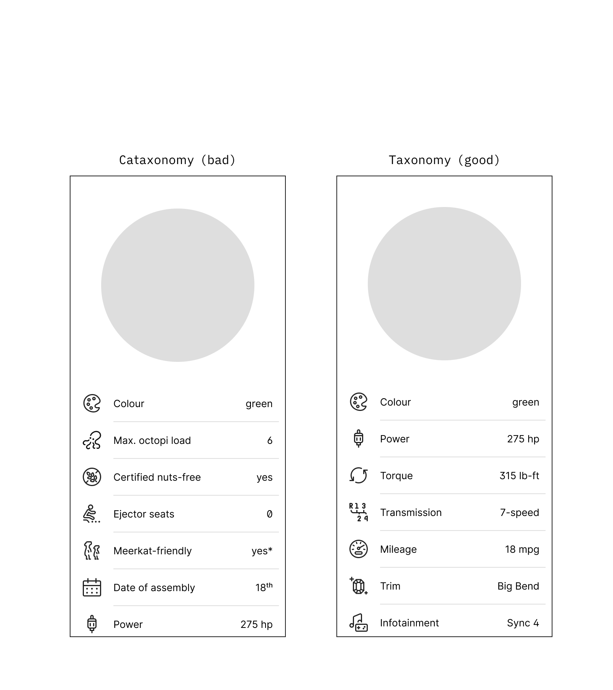

theme: UXASF1
autoscale: true

# Cataxonomies

<!-- Cacaxonomies -->

---

## Definition

**Cataxonomy: excessive labeling that ends up impairing communication.**

An accumulation of words that are technically true, but don’t immediately drive action or decision.

<!-- An accumulation of words that looks like a taxonomy, but doesn’t actually drive action or decision. -->

Worse, their presence and vagueness add noise to the conversation, slowing it down for no upside.

<!-- dead weight -->

<!-- It is therefore just noise, and ultimately has no other impact on operations than slowness and confusion. -->

<!-- Cataxonomies must be avoided. -->

^Note that this isn’t “ill defined” nor “untrue”, it’s “irrelevant”. The words can be 100% true, they are just useless. “Ok cool. Now what?”.

---

## Best Practices: Spotting

- Overly generic words that describe a concept rather than an attribute
- Overly domain-specific words
- Cool sounding words, and lot of them at once
- Single-use words disproportionately set to one value

<!-- Everything-bucket terms without a local definition -->

<!-- buzzwords -->

<!-- Red flag, polysemic -->

^A.k.a. the no-no list: “framework”, “platform”, “system”, “workspace”, etc.

^Cool sounding words *can* be mistaken for cool ideas, i.e. map-territory fallacy

---

## Best Practices: Fixing

- Check for up-to-dateness, wholeness, concision and consistency
- Remove problematic words
- Evaluate whether they need replacement at all; if yes break them down, replace them with generic alternative and/or define them locally

^If the authors get sentimental (e.g. afraid to “lose” something, or feeling that “we worked a lot on that”), problematic words can be moved to drafts or archives rather than outright deleted. The point is to remove them from taxonomy consumers’ point of view.

<!-- must/could/should its consequences -->

Cataxonomies are often a symptom of a weak underlying conceptual model. Consider fixing the latter first.

<!-- Consider clarifying it before attempting to fix the related cataxonomies. -->

---

## Best Practices: Preventing

- Ensure a clear scope, goals and ideally perspective
- Curate and maintain continuously
- Consider formats that could handle better some or all of the content: flowcharts, figures, post-it boards, terminology, etc.

^Perspective: that of stakeholders x, y or z, users, technical dependencies, etc.
