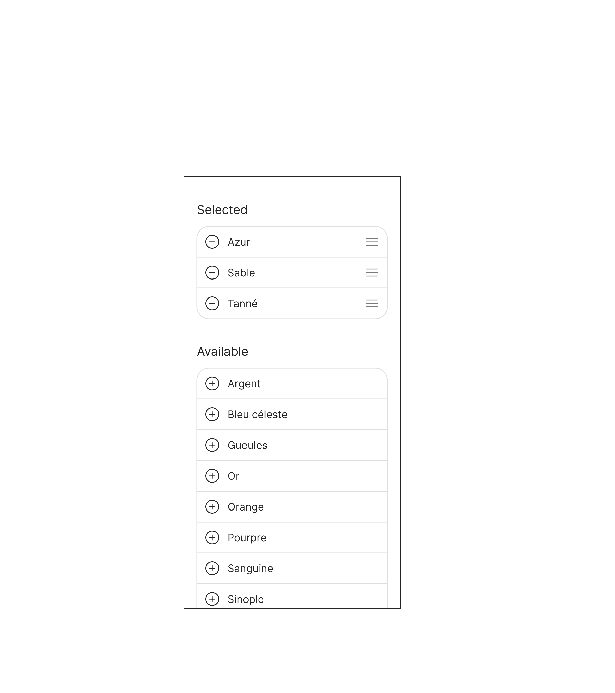
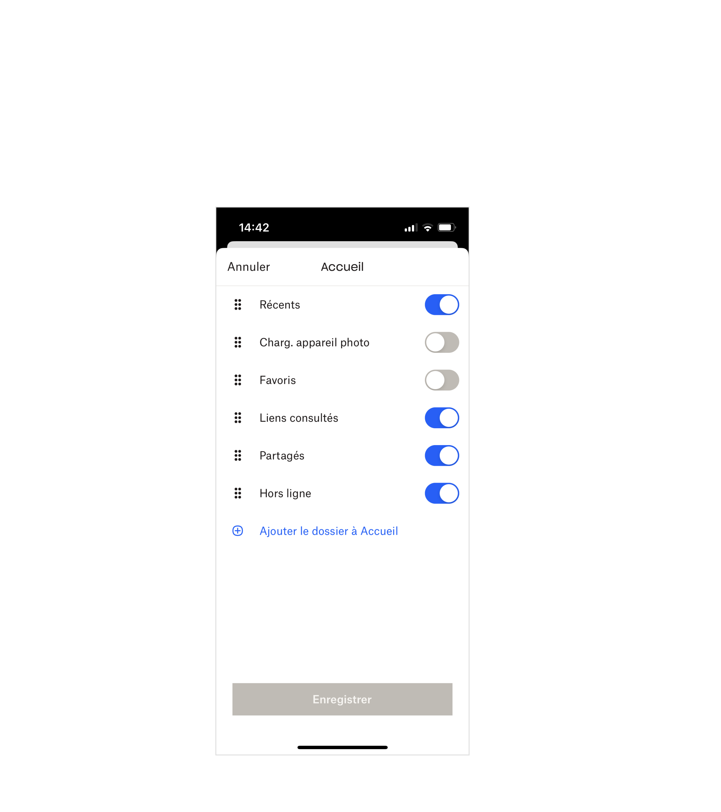
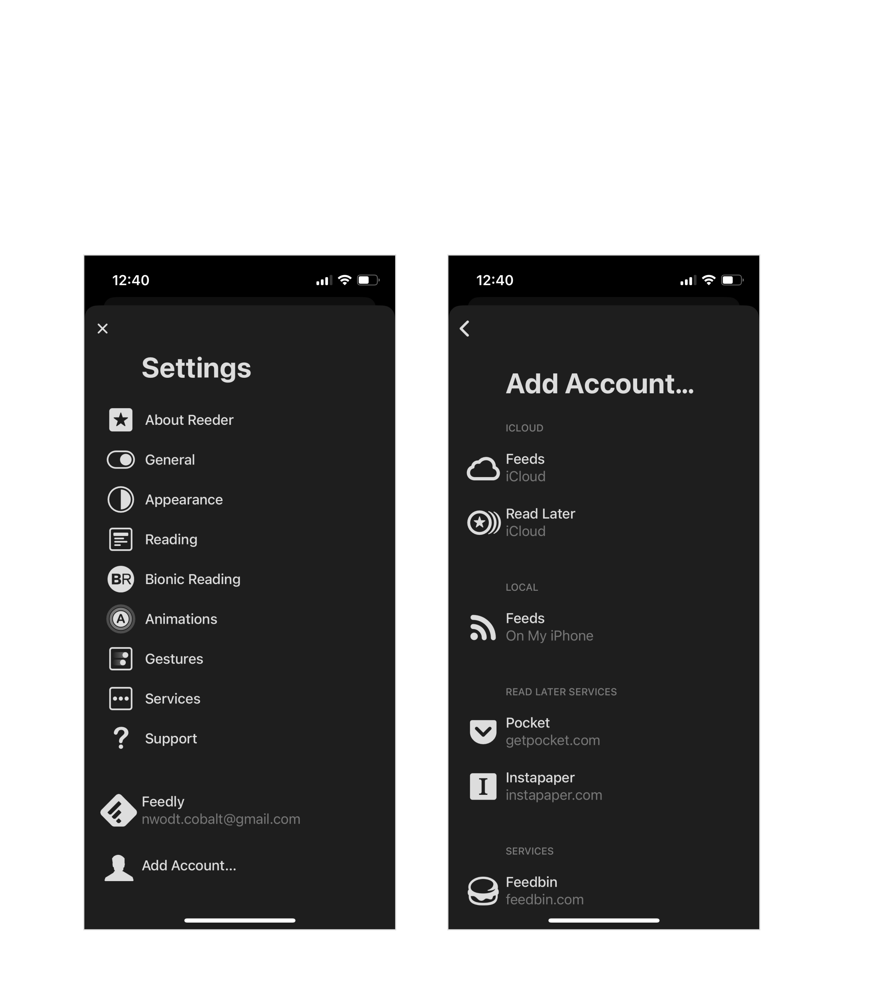

theme: UXASF1
autoscale: true

# Mobile List Builder

---

## Definition

**Mobile List Builder: a mean to select a subset of items from a larger set of items, on touch devices with small viewports.**

The mobile equivalent of traditional dual listbox [List Builder](https://en.wikipedia.org/wiki/List_builder).

In this pattern the selected items are persisted, as opposed to being dismissed after use (e.g. as in a fire-and-forget form submission).

<!-- Which would be a Mobile List Selector pattern -->

<!--
Also different from:

- List add. There need to be a collection/comparison, and more than 1-2 items selected.
- Picking from a ~data type picker (eg contacts, files, calendars, email contacts etc); need to entice/upsell
-->

---

## Example 1: Dropbox

Direct inline selection.

For very short lists.

---

## Example 2: Control Center

Indirect inline selection. A direct adaptation of the usual dual listbox.

Better suited to short lists of simple items.

<!-- Direct manipulation, on a single screen, simple/compact -->

---

## Example 3: Reeder

Selection from a modal sheet.

For slightly longer lists, potentially with some grouping and metadata.

---

## Example 4: Focus Mode

Selection from one or several progressively disclosed screens.

Suited for long lists. The selected items can have a different visual representation than the still-available ones (e.g. a compact summary morphology, vs a detailed metadata one).

<!--
## Example 5

studio editor (asymetric, eg shortcuts app)

## Example 6

inline edit (direct manipulation on the result, eg iphone widgets) when content is varied/visual/hard to predict or configure
-->

---

## Decision Criteria

- How long is the list; how many items are available, or expected to be selected
- How important is it to see details of items; in the available set, in the selected subset, or in both
- Do selected items have to be configured; if so, do they have to be configured on the spot or are good defaults enough to get started

---

## Best Practices

Few pattern-specific details:

- Labeling: `Selected` vs `Available`, `Included` vs `More`, etc.

Lots of generic list-related patterns, for example:

- Searching, sorting, filtering, grouping
- Reordering
- Items count
