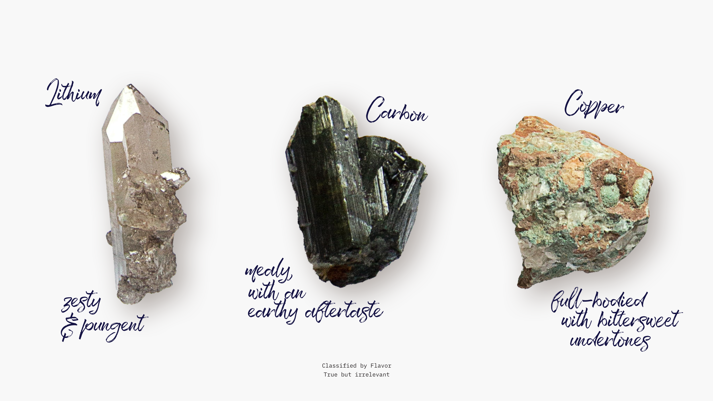
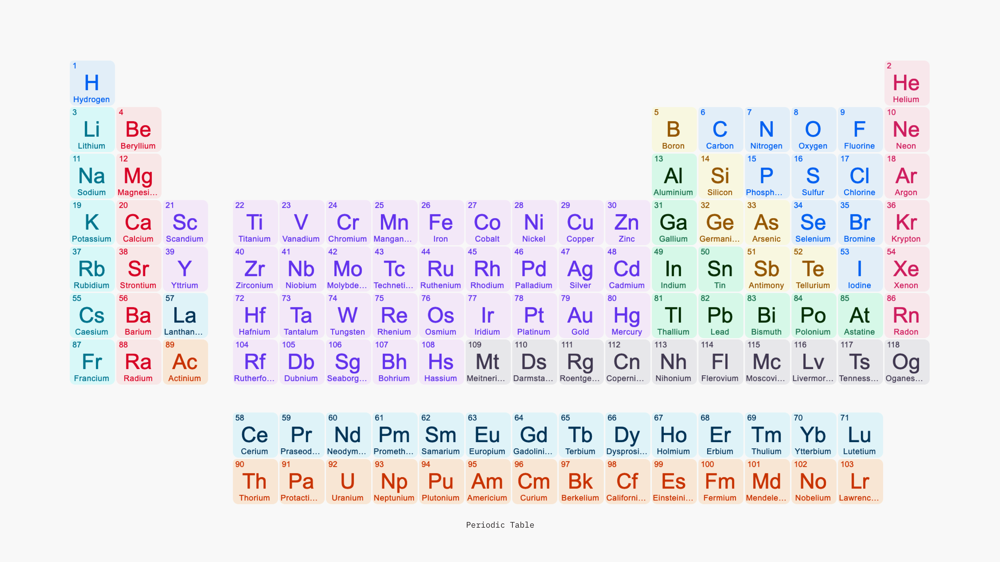

# Truth vs Relevance

<!-- a shorter parable: "the sun is larger than 2 football fields" -->

<!--
Credits:

- Crystals: [Franco Antonio Giovanella](https://unsplash.com/@francogio) on Unsplash
- Periodic table: [Google](https://www.google.com/)
-->

---

**Truth is necessary but not sufficient. Truth alone is not very useful; our criteria for quality communication is relevance.**

All communication should be relevant, especially when naming, describing or structuring entities.
Relevance is defined by actionability and indispensability.

<!-- meh -->

^“Actionability and indispensability” aren’t described further in this presentation.

---

^Classified by flavor: true but not relevant. It *is* true: several folks could all taste some lithium and consistently experience its zestiness. It’s just useless. It’s not matching usage, i.e. knowing the taste of a metal doesn’t help to do much with it.

---

^Classified by thermal conductivity: true, and narrowly relevant. It’s matching some usage. For example if we’re designing a heatsink, well now we know we should go for copper, because it has excellent thermal conductivity. So that’s something we can work with. However that’s as far as we can go with this one value. We couldn’t tell whether we should use copper for a beam (we don’t know its tensile strength), for a flywheel (we don’t know its density), or for an wire (we don’t know its electrical conductivity).
For example lithium is a key element of batteries, but there’s no way to tell from this one (thermal conductivity) value.

---

^Classified by atomic number: true and broadly relevant. It’s matching a lot of usages.

---

^The atomic number classification is actually *much more* relevant than “just” being useful to compare several properties of metals.
It’s not just *descriptive*, it’s *predictive*: many elements have been discovered by looking into the blanks of the table. Its structure generates content. Previous organizational schemes for elements were true, but not as relevant since they were lacking this predictive capability.
