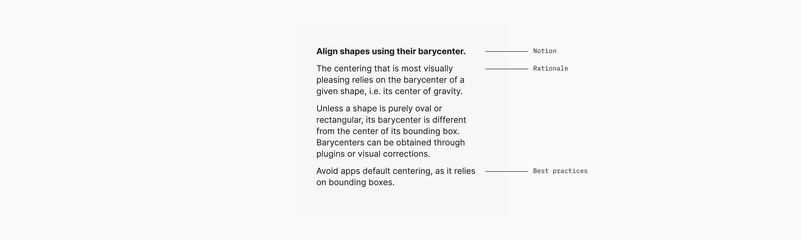

<# Writing Guidelines
<!--illustrating too; reword to ~"deliverables content and formatting" or so.-->

>Writing gets real when it is read. Before that, it is a dream in letters. Writing to get read makes you careful, responsible, and considerate.

— [Oliver Reichenstein](https://ia.net/topics/take-the-power-back/)

>The way you communicate a thing creates the thing. The thing does not exist apart from its own communication.

— [Matt LeMay](https://twitter.com/mattlemay/status/1389961793175310344)

<!-- This document aims to encourage the UXA practitioner to communicate and to do so quickly, consistently, and to great impact. -->

Communication is paramount because it clarifies thinking, enables collaboration and supports scale.

<!-- It is not an optional stage at the end of the thing, it is the thing. -->

This document encourages UXA practitioners to communicate — by providing guidelines for efficient, consistent and memorable material.

<!-- also aims for quality -->

<!-- on confond un peu l'obligation de qualité avec l'incitation à communiquer mais ok -->
<!-- quickly  -->

It's relevant for reference material, like best practices, and pedagogical material, like trainings. It's not relevant for pitching, marketing nor UI copywriting.
<!-- in presentation decks, folioed documents, wiki pages, or printed posters -->

## 1 Structure

### 1.1 Content Order

Overview/abstract/general before details/concrete/specific.

Start with good practices
Don't cover bad practices, unless some recurring misconception needs active correction.

### 1.2 Morphology

could it be a list, a comparison table, a data table, a diagram?

If text:
Each notion should be one paragraph and one only.
<!-- So it's actually one section -->

Each paragraph should be structured in the same way: first the notion expressed in a few words. Then its rationale (optional), best practices (optional) and alternatives (optional).  
everything but the idea is optional since in a lot of cases, the instruction standalone can be acted upon immediately, even if somewhat less effectively, while explanations can be added later. Thus trading depth for breadth allows for a quicker "initial overview".
No paragraph should be longer than 10-15 lines.

Alineas (line breaks) can be used within a paragraph to add structure.

### 1.3 Syntax

Apply a [parallel structure](https://owl.purdue.edu/owl/general_writing/mechanics/parallel_structure.html) whenever possible.

Apply a *must/could/should* structure whenever possible.

## 2. Content

### 2.1 Vocabulary

Be very mindful of the vocabulary. Prefer generic terms over specialized terms. Avoid synonyms, especially in domain-specific matters. Avoid fuzzy terms and everything-buckets.

*Keep annotations terse. Economy of concepts and terms is a primary goal.*

*Use only terms formally defined in the Design System. If new terms are introduced, they must be defined locally or globally.*

*Replace or clarify terms that could be interpreted in different ways. For example is “Alert” about a business rule, an error message, a push notification or an exception indicator?*

Avoid everything-buckets that don’t really describe anything, such as “Framework” or “Global”. It’s our job to spot those terms and replace them with clearer explanations.

Avoid fuzzy spelling, e.g. “dropdown” vs “drop-down” vs “drop down”.

From the [Swift API Design Guidelines](https://swift.org/documentation/api-design-guidelines/):

>Terms of art (words or phrases that have a precise, specialized meaning within a particular field or profession) are an essential communication tool, but should only be used to capture crucial meaning that would otherwise be lost. The only reason to use a technical term rather than a more common word is that it *precisely* expresses something that would otherwise be ambiguous or unclear.

>Embrace precedent. Don’t optimize terms for the total beginner at the expense of conformance to existing culture.

Avoid abbreviations.

*Highlight words Style to indicate to the reader that they refer to entities in our own design system, rather than generic notions.*

*Dans une procédure, l’identification des commandes et des équipements, le texte des messages d’alarme, le numéro des salles, etc. sont tous écrits exactement tel que l’opérateur les voit sur place, sur les gravures, les plaquettes d’identification, les écrans cathodiques ou autres indications visuelles.*

*Pour chaque action significative ou groupe d’actions significatives reliées, on inclut une ou des vérifications afin de s’assurer que leur exécution a apporté les résultats attendus.*

*Un organigramme pourrait être nécessaire pour faciliter l’application de la procédure.*

### 2.2 Illustrations

*illustrations usage != illustrations authoring*

Illustrate profusely. At least an illustration every 3-4 slides. They help keep reader interest.

Always associate illustrations directly to the content they support, e.g. floated right.  
Avoid full-page illustrations, as they lack the context required to be useful.

Don't illustrate bad practices. In the rare case a bad practice has to be depicted, always depict the corresponding good practice immediately next to it.

Force bg

### 2.2 Sourcing & Attribution

dont reivent the wheel for nothing ; check for prior data
authoritative / verified / quality (in data, in presentation) sourcing

Always give proper attribution: inline, in footnotes, or in a dedicated section. , e.g.

## 3. Tone & Voice

Be assertive and impersonal, from the author and to the reader. Use the present tense and the *active form*.

Use the [singular *they*](https://en.wikipedia.org/wiki/Singular_they) form.

*Privilégier les énoncés affirmatifs plutôt que négatifs. Faire porter les énoncés sur ce qui est vrai plutôt que sur ce qui est faux (dans les tâches de vérification). Raison: on est plus rapide à vérifier ce qui est vrai que ce qui est faux.*

## 4. Formatting

### 4.x Conventions

Use **strong** styling for keywords. *expand with dod material*

avoid parentheses. use commas or rephrase.

<!-- Un titre d’activité ne contient pas de verbe d’action afin de ne pas le confondre avec une étape. -->

### 4.1 Typographic Signs

Be mindful about typographic signs.

Use proper apostrophes and quote marks ([smart-quotes-plus package](https://atom.io/packages/smart-quotes-plus)), multiplication signs, etc.

- [Glyphy](https://www.glyphy.io/) (e.g. ·, ↪, ⚠)
- [Subscripts and superscripts](https://en.wikipedia.org/wiki/Unicode_subscripts_and_superscripts) (e.g. ⁿᵈ, ⁴)

Conventions:

- e.g.
- etc.
- i.e.

### 4.2 Foreign Words

Italics, translation right after in parentheses.

<!-- # Under Consideration

- format deckset presenters notes (they render formatted on deckset and on gith
- <https://www.smashingmagazine.com/2021/10/resources-tools-turbocharge-copywriting-skills/>
- UXA·ID
- Page numbers?
- Titles on individual slides?
- Highlight sparsely (e.g. command names, symbol names)?
- TOC, recap?
- DOs/DONTs vs only DOs vs good/better/best?
- Qualités: Validité, Clarté/Transparence, Granularité, Uniformité, Cohérence,
Complétude, Disponibilité, Accessibilité, Utilisabilité
- Preferred date/time format, numbers format etc
- <https://polaris.shopify.com/content/grammar-and-mechanics#basics>
- Always provide local context (scope, assumptions, environment etc)
- <https://github.com/cezaraugusto/github-template-guidelines>
- Recommended types of content: quick diagrams, reference ppt
- split between long form and quicker tips/conventions?

HFDS 2003: *lots of overlap == prune and rephrase, and give general credit*

- The preferred length of paragraphs is three or four sentences, but five or six are acceptable.
- The preferred average sentence is 17 words or less, but up to 20 is acceptable.
- Active, not passive voice.
- Second person imperative ("Remove test set").
- Positive wording. Use negative wording for prohibition or to correct misconceptions.
- Consistent phrases.

What to define ? Technical terms, uncommon words, common words that are used in an unusual or special way.
When several (about 10) new terms are abbreviations are used a glossary or list of acronyms would be included.
Words or terms that must be defined shall be defined immediately following their first occurrence in the text.

Numbers representing quantities of 10 or more shall be expressed in numerals ; those representing quantities less than 10 shall be expressed in words. If a number is the first word in a sentence, it shall be expressed in words.

Major divisions of the document should begin on right hand-pages. Right-hand pages shall be odd-numbered pages, and left hand pages shall be even-numbered pages.

If typographic emphasis is used, it shall be boldface type.

A user document shall have a table of contents unless it has fewer than three divisions or fewer than six pages. A table of contents shall include: (a) at least two levels of the headings and subheadings of the document, (b) appendixes if they exist, (d) list of exhibits, illustrations, figures and tables if they exist, and (e) the original page number of each item listed. The table of contents shall begin on a right-hand page.

Consistent pictorial style. All comparable figures in a document shall be prepared in the same style, for example, all line drawings, or all photographs.

Ponctuer les éléments de liste. D’un point s’il s’agit d’une phrase complète, ou de plusieurs phrases. De virgules le cas échéant. L’avant-dernier élément sera complété par “et” ou “ou”, et le dernier élément terminé par un point.

Growing to curriculums:

Order of exposition. Each level exponentionally longer than the previous one.

1. Result/guidance
2. Rationale, explanation of the underlying concept
3. Further reading (connection to other concepts, variants, perspectives, controversies, details etc.) -->
