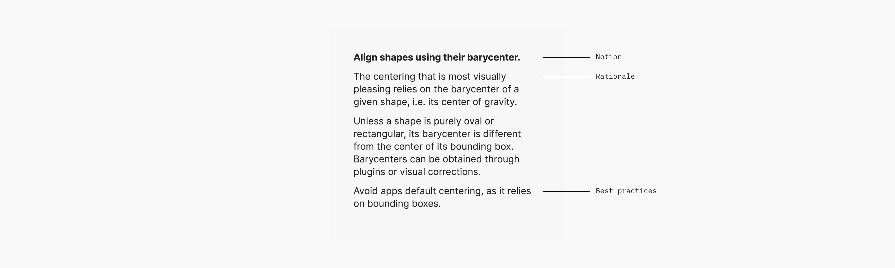
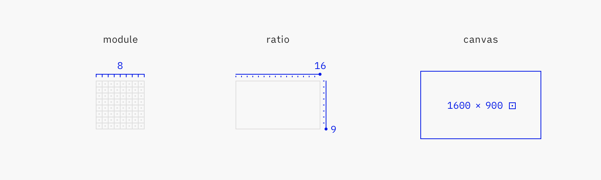
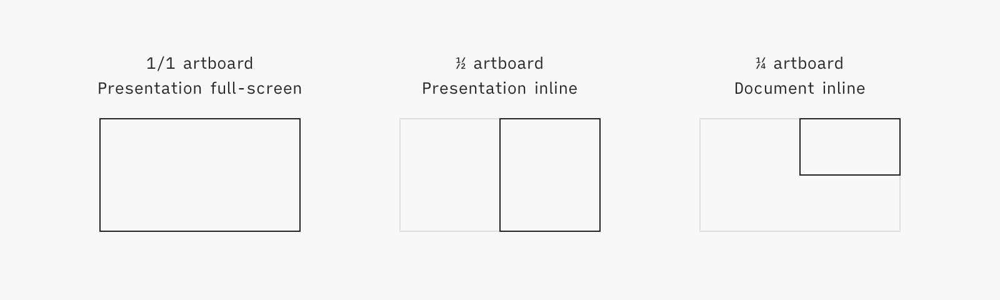
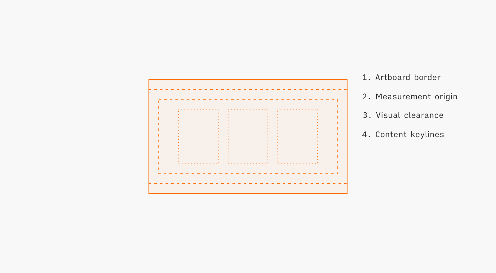
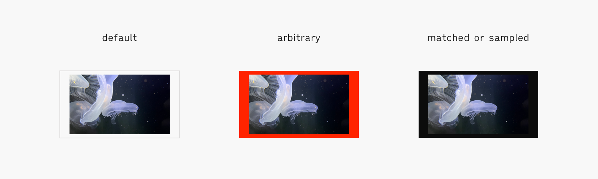

# Communication Guidelines

 

>Writing gets real when it is read. Before that, it is a dream in letters. Writing to get read makes you careful, responsible, and considerate.

— [Oliver Reichenstein](https://ia.net/topics/take-the-power-back/)

>The way you communicate a thing creates the thing. The thing does not exist apart from its own communication.

— [Matt LeMay](https://twitter.com/mattlemay/status/1389961793175310344)

<!--BREAK-->

## Introduction

Communication is integral, not additive, to architecture — because it clarifies thinking, enables collaboration and supports scale.

This document encourages UXA practitioners to communicate — by providing guidelines for efficient, consistent and memorable material. Practitioners are expected to be familiar with UX concepts, that are only explained here when then have a specialized meaning in architecture. This document is thus a reference handbook: it inventories UXA conventions and parameters, but doesn't explain nor justify them.

<!-- quick and easy for the author, consistent and memorable for the reader -->

This document is relevant for reference material, like best practices, and pedagogical material, like trainings. It's not relevant for pitching, marketing nor UI copywriting.
<!-- in presentation decks, folioed documents, wiki pages, or printed posters -->

<!--BREAK-->

## 1 Structure

### 1.1 Content

Always provide local context (scope, assumptions, environment etc); invisible meta on *everything*

Content Order: Overview/abstract/general before details/concrete/specific.

Start with good practices
Don't cover bad practices, unless some recurring misconception needs active correction.

<!-- DOs/DONTs vs only DOs vs good/better/best? -->

Expose the intention > explain the behaviour > describe the properties
Illustrate with tokens: tool for spec & governance > capture design decision > json kvp

split between long form and quicker tips/conventions

+notion of it has to be simplified, caricatural, true enough to not suspend disbelief etc; in writing or illustrating

### 1.2 Morphology

could it be a list, a comparison table, a data table, a diagram, a reference ppt? *Make a super clear, super big decision tree for "how to shape your content/here's a boilerplate" depending on the deliverable. Eg best practices page: start from a must/could/should bullet list, etc.*

If text:

Each notion should be one paragraph and one only.
<!-- So it's actually one section -->

Each paragraph should be structured in the same way: first the notion <!-- result/guidance --> expressed in a few words. Then its rationale (optional), best practices (optional) and alternatives (optional). <!-- Further reading (connection to other concepts, perspectives, controversies, details etc.) -->  
everything but the idea is optional since in a lot of cases, the instruction standalone can be acted upon immediately, even if somewhat less effectively, while explanations can be added later. Thus trading depth for breadth allows for a quicker "initial overview".
No paragraph should be longer than 10-15 lines.

Alineas (line breaks) can be used within a paragraph to add structure.

- The preferred length of paragraphs is three or four sentences, but five or six are acceptable.
- The preferred average sentence is 17 words or less, but up to 20 is acceptable.

<!--BREAK-->

## 2. Writing

### 2.0 Syntax

Apply a [parallel structure](https://owl.purdue.edu/owl/general_writing/mechanics/parallel_structure.html) whenever possible.

Apply a *must/could/should* structure whenever possible. <https://www.rfc-editor.org/rfc/rfc2119>

### 2.1 Vocabulary

Be very mindful of vocabulary.

Prefer generic terms over terms of art. Terms of art (words or phrases that have a precise, specialized meaning within a particular field or profession) are an essential communication tool, but should only be used to capture crucial meaning that would otherwise be lost. The only reason to use a technical term rather than a more common word is that it precisely expresses something that would otherwise be ambiguous or unclear.

Define technical terms, uncommon words and common words that are used in an unusual or special way. Define them immediately following their first occurrence in the text.

Avoid abbreviations.

When several (about 10) new terms or abbreviations are used, provide a glossary or list of acronyms.
Include it in the document, or contribute and link to the **Vocabulary** (to be published).

Avoid synonyms, especially in domain-specific matters, as well as fuzzy terms and everything-buckets. Aim to reuse the same, simple words as much as possible.

Replace or clarify terms that could be interpreted in different ways. E.g. it is not clear if an “alert” is about an error message, a business rule, a push notification or an exception indicator.

Avoid fuzzy spelling, e.g. “dropdown” vs “drop-down” vs “drop down”.

When referring to existing content, such as a UI or a diagram, spell commands, labels or messaging exactly as they appear in situ.

Everything-buckets are ill-defined terms that don’t really describe anything, such as “framework”. Their looseness often provide the appearance of agreement, to the detriment of actionability. Spot them and replace them with clearer explanations.

### 2.3 Tone & Voice

For descriptions, use the present tense and the active form (“Selecting a value triggers validation”).
For instructions, use the second person imperative (“Remove test set”).

Prefer positive wording, and statements directed to what's true rather than what's false.  
It's quicker to check what's true rather than what's false.  
Use negative wording for prohibition or to correct misconceptions.

In any case be assertive, impersonal and use the [singular *they*](https://en.wikipedia.org/wiki/Singular_they) form.

<!-- Faire porter les énoncés sur ce qui est vrai plutôt que sur ce qui est faux (dans les tâches de vérification). Raison: on est plus rapide à vérifier ce qui est vrai que ce qui est faux. -->

### 2.2 Attribution

dont reinvent the wheel for nothing ; check for prior data
authoritative / verified / quality (in data, in presentation) sourcing
<!-- Heh == prefer authoritative data -->
<!-- Sourcing is a whole other topic -->

Always give proper attribution: inline, in footnotes, or in a dedicated section. In the format that's demanded in the readme or license.

format for inline (text or pic) or reference attribution

verify authorized usage

### 2.4. Formatting

<!-- Heh pas terrible, c'est plutôt "conventions et finitions" -->

#### 2.4.1 Style Conventions

Use title case for headings.

If typographic emphasis is used, it shall be boldface type.
Use **strong** styling for keywords. *expand with dod material*

Avoid parentheses. Use commas or rephrase.

<!-- Un titre d’activité ne contient pas de verbe d’action afin de ne pas le confondre avec une étape. -->

explicitly declare normative vs non-normative sections

Preferred date/time format, numbers format etc

Ponctuer les éléments de liste. D’un point s’il s’agit d’une phrase complète, ou de plusieurs phrases. De virgules le cas échéant. L’avant-dernier élément sera complété par “et” ou “ou”, et le dernier élément terminé par un point.

Numbers representing quantities of 10 or more shall be expressed in numerals ; those representing quantities less than 10 shall be expressed in words. If a number is the first word in a sentence, it shall be expressed in words.

#### 2.4.2 Typographic Signs

Be mindful about typographic signs.

Use proper apostrophes and quote marks ([smart-quotes-plus package](https://atom.io/packages/smart-quotes-plus)), multiplication signs, etc.

- [Glyphy](https://www.glyphy.io/) (e.g. ·, ↪, ⚠)
- [Subscripts and superscripts](https://en.wikipedia.org/wiki/Unicode_subscripts_and_superscripts) (e.g. ⁿᵈ, ⁴)

Conventions:

- e.g.
- etc.
- i.e.

#### 2.4.3 Foreign Words

Italics, translation right after in parentheses.

<!--BREAK-->

## 3 Illustrating

### 3.1 Usage

When/what to illustrate: covers/back covers for style, caricatured examples for trainings, charts-instead-of-text, etc.

Illustrate profusely. At least an illustration every 2-3 slides. They help keep reader interest.

Always associate illustrations directly to the content they support, e.g. floated right.

Make sure full-page illustrations are commented in *presenter's notes* (see xxx) as otherwise they lack the context required to be useful.

Don't illustrate bad practices. In the rare case a bad practice has to be depicted, always depict the corresponding good practice immediately next to it.

### 3.2 Style

Use a consistent pictorial style for all comparable figures in a document, for example, all line drawings, or all photographs. Follow the style provided by the [moodboard](https://www.pinterest.ca/nwodtcobalt/uxa/).

<!-- examples & definitions: illustration, diagram, chart, photograph, gif, screenshot . All of it: figures -->

Photographs or screenshots can be used as examples or explanations, but should not be used for editorial purposes. Prefer illustrations.

### 3.3 Grid

This guidance is most relevant for heavily templated tools like Deckset or Marked, that offer little control over the size, position or treatment of images. Manually laid out documents may go past the conventions covered here.

Units can be expressed as pixels (px), points (pt) or dips (dp) depending on the OS. They are hereafter noted as pixels for clarity.

<!-- A **unit** is the smallest measure a vertex can be positioned at accurately. It depends on the physical and logical resolution of the device, and can be expressed as pixels (px), points (pt), dips (dp). Units are hereafter noted as pixels for clarity. -->

#### 3.3.1 Parameters

The UXA grid is set to an 8 px module.

<!--
| Parameter     | Value         | Definition                                               |
| ------------- | ------------- | -------------------------------------------------------- |
| Module        | 8 px          | The recurring measure vertices are anchored at           |
| Aspect ratio  | 16:9          | The relative size of the width to the height of an image |
| Artboard size | 1600 × 900 px | The absolute size of an image                            |
 -->

#### 3.3.2 Form Factors/Layout

While the canonical 1600 × 900 px artboard size is well-suited to full-screen rendering, it can be unwieldy to use alongside text. Derived artboard sizes are available:

| Type         |  Size (px) | Usage                                                       |
| ------------ | ----------:| ----------------------------------------------------------- |
| 1 artboard   | 1600 × 900 | Full-screen in presentation  (or stand-alone, or in poster) |
| 1/2 artboard |  800 × 900 | Inline in presentation (e.g. next to bullet points)         |
| 1/4 artboard |  800 × 450 | Inline in document (e.g. between two paragraphs)            |

Artboards contain various guides helping to lay out content quickly and consistently:

1. Artboard: export frame of the figure
2. Measurement origin: virtual border from which all content should be measured and aligned. Set so that content can be laid out on a 8 px grid within the larger 1600 × 900 px artboard, that doesn't support it by default.
3. Visual clearance: 40 px for docs, 40/80 px for slides (against canvas edge, not safe area edge. Exceptionally 10px, eg screenshot (and most dont qualify to begin with). full bleed only for impact, on bg stuff.
4. Content keylines: optional preferred positions for content

Inline doc: shave vertically as much as possible (to not disrupt reading flow).
Can be vertically shortened (only at export time, so that it's easy to get back to nominal).
try and catch a preferred size.

#### 3.3.3 Preferred Sizes

Specific values along the 8 px grid are preferred when working on editorial layouts.

While an 8 px module is appropriate for fine work like UI design, it's too granular for illustrations or pages layout, where elements are sized and positioned at a much bigger scale. Thus specific, bigger values are picked out of all the possible multiples of 8.

The preferred values are multiples of 8 (the UXA grid module) and 10 (another frequent grid module), ensuring scale and compatibility. Multiples of 4 (half UXA grid module) and 10 are also possible, as a second choice. Straight multiples of 8 are the last resort.

<!-- scales, series, stop points? major, minor, module? preferred, possible, fallback? -->
<!-- the half module series are identical: n(4 × 10) = n(8 × 5) -->

[Preferred Sizes]
| Priority | Rythm (px) | Sample values (px)                                    |
| -------- | ---------- | ----------------------------------------------------- |
| 1        | 8 × 10     | 80, 160, 240, 420, 400, 480, 560, 640, 720, 800, etc. |
| 2        | 4 × 10     | 40, 80, 120, 160, 200, 240, 280, 320, 360, 400, etc.  |
| 3        | 8 × 1      | 8, 16, 24, 32, 40, 48, 56, 64, 72, 80, etc.           |

Note that these preferred values are just a starting point, merely minimizing accidental divergences. Better layouts would require further refinement, like [harmonic scales](https://type-scale.com/) or [Renard series](https://en.wikipedia.org/wiki/Renard_series).

### 3.4 Export

<!-- svg > pdf > png > jpg -->

Export to SVG by default.  
SVG files are scalable, interoperable, programmatically manipulable and lightweight.
Some specific use cases may require other formats:

| Priority | Format | Scaling | Usage                                            |
| -------- | ------ | ------- | ------------------------------------------------ |
| 1        | SVG    | 1x      | Vector figures without text (e.g. illustrations) |
| 2        | PDF    | 1x      | Vector figures with text (e.g. diagrams)         |
| 3        | PNG    | 2x      | Screenshots, UI mockups                          |
| 4        | JPG    | 2x      | Photos, scanned documents                        |

Set an illustration background color, `Gris 0106 Béton Clair` by default.
<!-- Marked-only? -->

Illustration assets can be rendered in a variety of contexts such as a high-contrast Markdown client, a dark-mode browser or a hand-off, inspection or version control tool. Their background color is unknown, and some of them could make the illustration foreground illegible.

Moreover, some photos may not have a 16:9 aspect ratio meaning the document background will bleed through. Depending on the photo color, the `Gris 0106 Béton Clair` background may not work well. In this case, it's possible to select the closest-matching UXA color (e.g. `Noir 1571 Jais`), or to sample an appropriate color from the photo.
<!-- Heh that's actually slide bg , not illo bg + 90% scaling-->

Do not pick an arbitrary background color for editorial purposes, like calling for attention.
<!-- divider entre recommendations marked et recommendations deckset ? peu d'overlap au final -->

### 3.5 Examples

*florilège annoté*

<!--BREAK-->

## 4 Deckset & Marked Minutiae

### 4.1 Marked

Finalize document:

- Insert a `<!--BREAK-->` tag immediately after the top H1, to yield a clean cover page

Configure Marked:

- Enable `Export/Prevent orphaned headlines`
- Enable `Export/Add page breaks before/Footnotes`

Export with Marked:

- Set the theme to [UXASF1](https://github.com/nWODT-Cobalt/markown-utilities)
- Select `Export As/Save PDF (Paginated)`

<!-- Major divisions of the document should begin on right hand-pages. Right-hand pages shall be odd-numbered pages, and left hand pages shall be even-numbered pages. -->

<!-- A user document shall have a table of contents unless it has fewer than three divisions or fewer than six pages. A table of contents shall include: (a) at least two levels of the headings and subheadings of the document, (b) appendixes if they exist, (d) list of exhibits, illustrations, figures and tables if they exist, and (e) the original page number of each item listed. The table of contents shall begin on a right-hand page. -->

### 4.2 Deckset

Present or export Deckset presentations with the [UXASF1](/Resources/Deckset) theme.

<!-- Keep it focused, keep it small. 5 slides or less is perfectly fine. People can’t remember more than 3 points from a speech. (KK) -->
<!-- Actually: make small, focused documents all the time -->

Do not hesitate to format Deckset presenter's notes; they will render so on Deckset and on Github.

<!--BREAK-->

## 5 Naming Convention & File Organization

<!-- Split into different document ? -->

Naming schemes ? esp for artboards

Names: case sensitive, no spaces (within a project, not between projects)

<!--BREAK-->

## 9 Credits/bibliographie

- Règles rédaction de Foulon
- HFDS 2003
- IND6408
- [Swift API Design Guidelines](https://swift.org/documentation/api-design-guidelines/)

<!--BREAK-->

# Under Consideration

Check out:

- Handbook / IND6408
- <https://www.smashingmagazine.com/2021/10/resources-tools-turbocharge-copywriting-skills/>
- <https://polaris.shopify.com/content/grammar-and-mechanics#basics>

TBD:

- UXA·ID?
- Page numbers?
- Titles on individual slides?
- Highlight sparsely (e.g. command names, symbol names)?
- TOC, recap?
- Qualités: Validité, Clarté/Transparence, Granularité, Uniformité, Cohérence, Complétude, Disponibilité, Accessibilité, Utilisabilité
- Highlight words Style to indicate to the reader that they refer to entities in our own design system, rather than generic notions.
- Pour chaque action significative ou groupe d’actions significatives reliées, on inclut une ou des vérifications afin de s’assurer que leur exécution a apporté les résultats attendus.
- Embrace precedent. Don’t optimize terms for the total beginner at the expense of conformance to existing culture.
- Keep annotations terse. Economy of concepts and terms is a primary goal.
