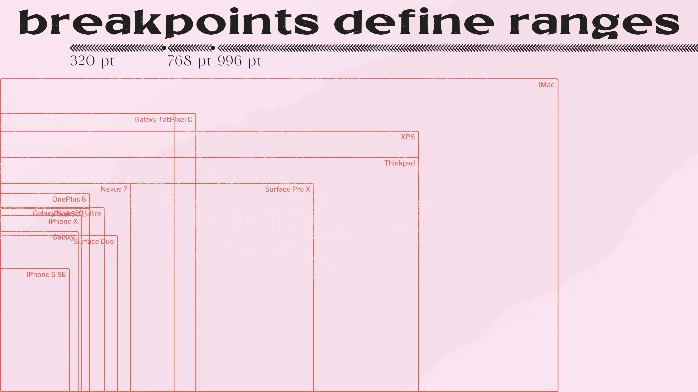
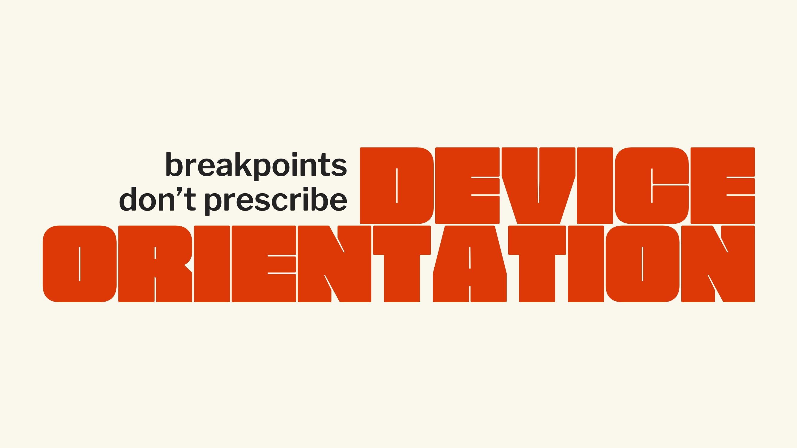

theme: UXASF1
autoscale: true

# Examples of Good Communication Material

<!-- ## Communication Material
# **Examples** -->

<!--  -->

---

[.text: #F8F8F8, alignment(center)]
[.background-color: #232323]

---

only one statement on the slide + attention-calling type treatment

[.text: #F8F8F8, alignment(center)]
[.background-color: #232323]

---

*background cover image*
