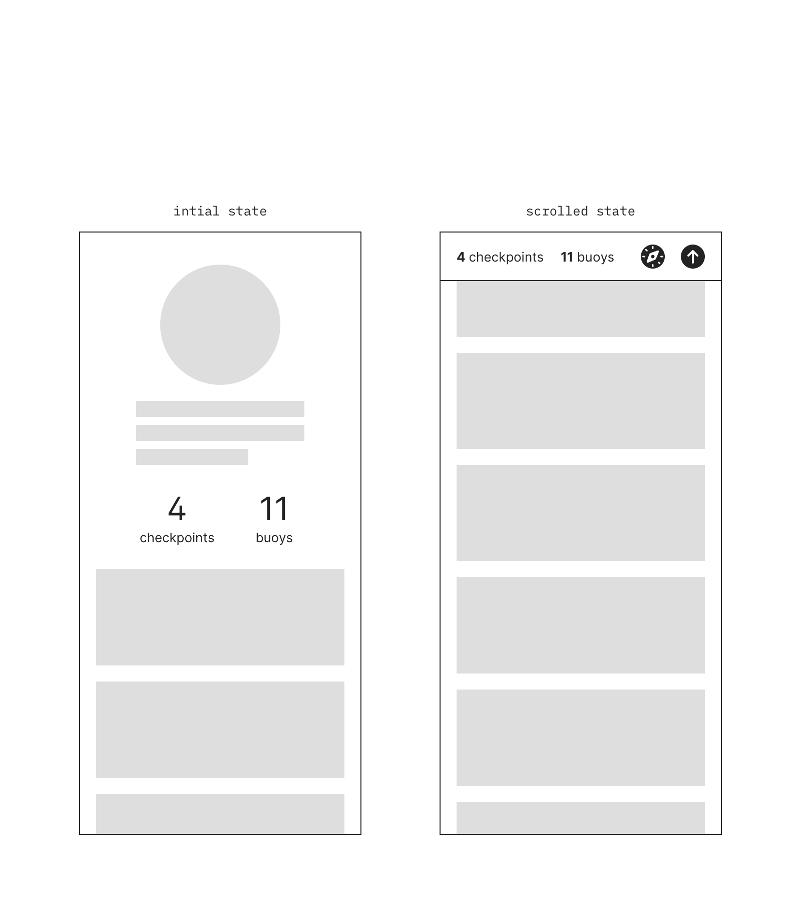
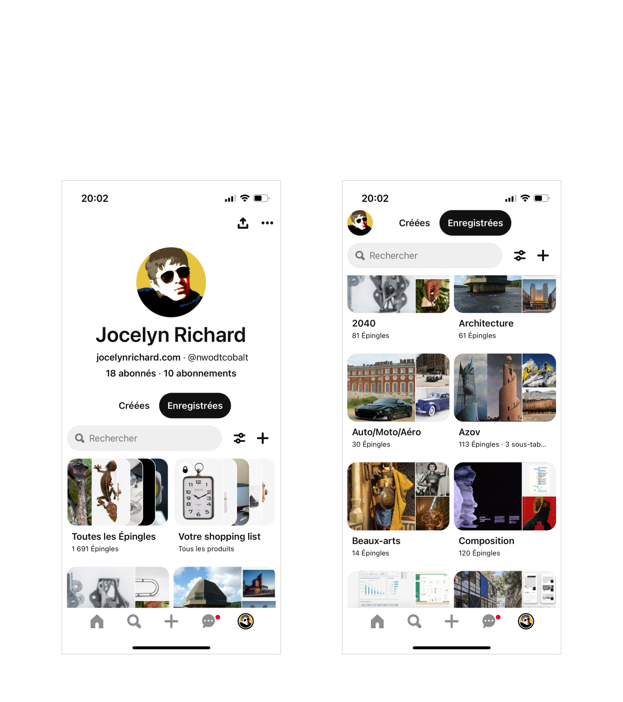
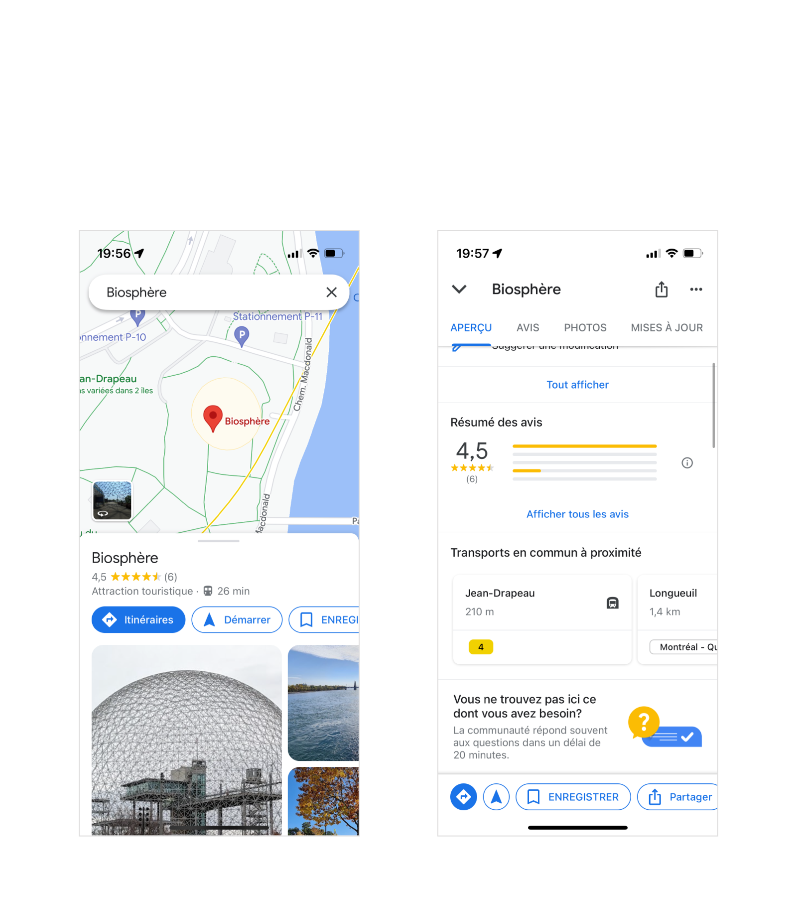
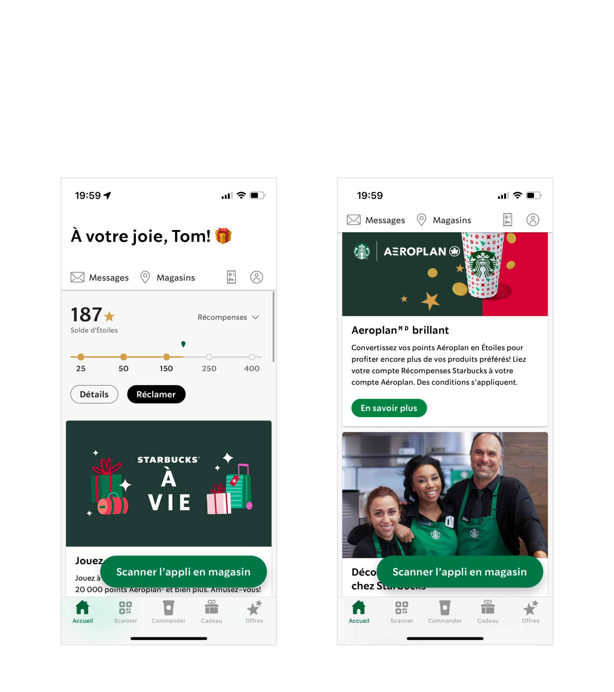

theme: UXASF1
autoscale: true

# Mutable Inline Navigation

<!-- Malleable header-->

<!-- [.footer: UXAID] -->

---

## Pattern

**A secondary navigation device,
slightly changing in appearance and functionality upon content scroll.**

<!-- actually swapping one version of the nav to another -->

Used for shortcuts or secondary locations, in rich multimedia views within complex apps.

---

## Example 1: Pinterest

In the initial state, the user avatar is a share button. In the scrolled state, the user avatar is a back-to-top button.

Selecting `Created` (“Créées”), `Saved` (“Enregistrées”) or `Search` (“Rechercher”) automatically puts the view into scrolled state.

In both states, the `Preferences` and `Create` buttons trigger modal overlays.

---

## Example 2: Google Maps

Actually several successive levels of **Mutable Inline Navigation**.

In the final scrolled state, the layout and features have changed: buttons are replaced with tabs, the title gets a different treatment and content controls are added.

The caret next to the name of the venue (“Biosphère”) resets the view to the initial state.

---

## Example 3: Starbucks

`Messages`, `History` and `Account` drill down to new views, still within the `Home` tab.

`Shops` (“Magasins”) triggers a modal overlay.

<!-- thats just a sticky scroll -->

---

## Best Practices

- Intrinsic
    - Printed inline in a content view
    - Can be implemented with links, actions, icons, status indicators, counters etc.
    - Can lead to another position the current view, an overlay to the current view, or to a child view

- Upon scroll
    - Sticky at top
    - Changes in appeareance and functionality, possibly more than once
    - Keeping some visual continuity between states
    - “Reset view” control
